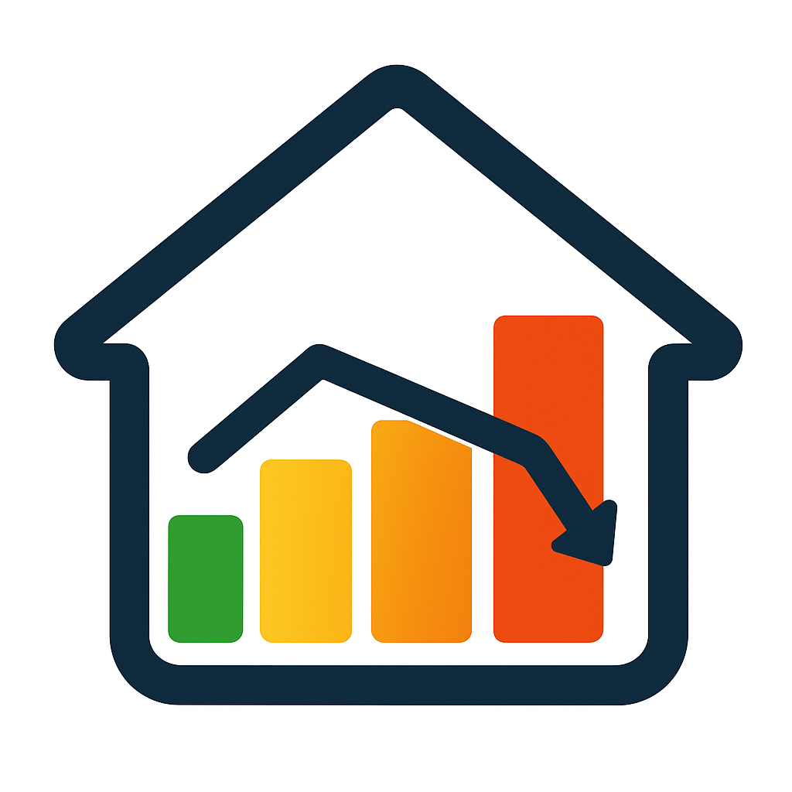

# EffektGuard

# ⚠️ WORK IN PROGRESS ⚠️

**This integration is currently under active development and is NOT ready for production use.**

Do not attempt to install or use this integration yet. Documentation and releases will be published when ready.

---

## What is EffektGuard?

EffektGuard is a Home Assistant custom integration for intelligent NIBE heat pump control, optimizing for Swedish electricity costs while maintaining comfort and heat pump health.

### Goals

When complete, EffektGuard will:

- **Optimize for Swedish electricity tariffs**: Both spot prices (öre/kWh) and effect tariffs (kr/kW)
- **Maintain comfort**: Never sacrifice indoor temperature for cost savings
- **Protect heat pump health**: Safety-first approach based on NIBE research
- **15-minute optimization**: Native support for quarterly electricity pricing
- **Automatic operation**: Set it and forget it - no manual adjustments needed

### Target Users

- Swedish NIBE heat pump owners (F2040, F750, S-series)
- Using MyUplink integration in Home Assistant
- Have spot price integration (GE-Spot recommended for 15-minute data)
- Want to reduce both energy cost AND effect tariff charges

### How It Works

EffektGuard adjusts your heat pump's heating curve offset based on:

1. **Electricity prices**: Pre-heat during cheap hours, reduce during expensive hours
2. **Effect tariff**: Avoid creating new monthly peaks
3. **Weather forecast**: Predict heating needs in advance
4. **Indoor temperature**: Maintain comfort within your set limits
5. **Thermal debt (Degree Minutes)**: Monitor heat pump strain to prevent damage
6. **Climate zone**: Automatically adapts to your location (Arctic to Mediterranean)

All optimization respects safety thresholds derived from real-world NIBE case studies.

### Climate-Aware Optimization

EffektGuard automatically detects your climate zone based on latitude and adjusts thermal debt (degree minutes) thresholds accordingly:

- **Extreme Cold** (Arctic Circle+, 66.5°N+): Kiruna, Tromsø - expects DM -800 to -1200 in winter
- **Very Cold** (60.5-66.5°N): Luleå, Umeå - expects DM -600 to -1000 in winter
- **Cold** (56-60.5°N): Stockholm, Oslo, Helsinki - expects DM -450 to -700 in winter
- **Moderate Cold** (54.5-56°N): Copenhagen, Malmö - expects DM -300 to -500 in winter
- **Standard** (<54.5°N): Everything else - minimal heating demands

**What this means:** In Kiruna at -30°C, DM -1000 is perfectly normal! The system understands that Arctic heat pumps work much harder than those in Paris. No configuration needed - just works globally.

**[Read more about Climate Zones →](docs/CLIMATE_ZONES.md)**

## Development Status

Currently implementing core functionality. See commit history for progress.

For detailed technical documentation, see the `IMPLEMENTATION_PLAN/` directory.

**Key documentation:**
- [Climate Zone System](docs/CLIMATE_ZONES.md) - Automatic climate adaptation
- Architecture documents in `architecture/` directory
- Implementation plan in `IMPLEMENTATION_PLAN/` directory

## License

MIT License - See LICENSE file

## Author

**enoch85** - [@enoch85](https://github.com/enoch85)
