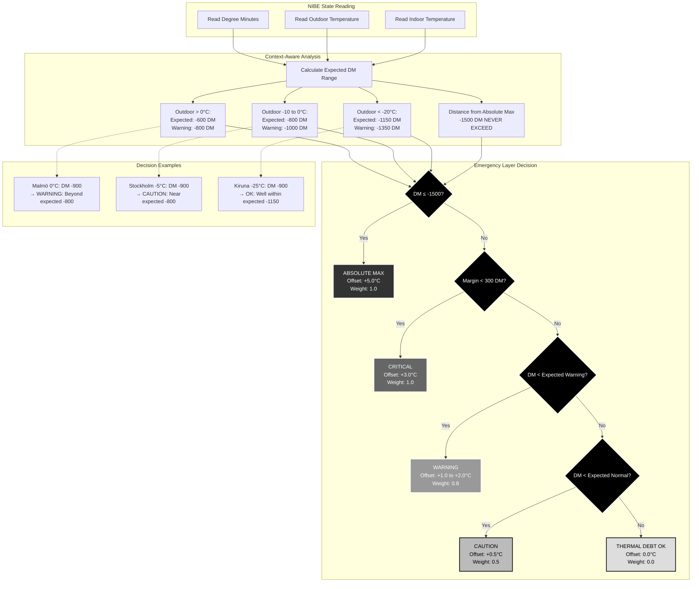

# Scenario 2: Emergency Thermal Debt Response

**Description**: Context-aware emergency response when degree minutes approach critical thresholds.

## Context-Aware Safety Philosophy

### Smart Adaptation vs Fixed Thresholds

Instead of using fixed degree minutes thresholds, EffektGuard employs **context-aware analysis** that understands what's "normal" for the current outdoor temperature:

- **At -30°C in Kiruna**: DM -1000 might be completely normal
- **At 0°C in Malmö**: DM -1000 indicates a serious problem

This approach automatically adapts to ANY Swedish climate without complex configuration.

### Temperature-Based Expected Ranges

The system calculates expected DM ranges based on outdoor temperature:

#### Mild Weather (> 0°C)
- **Expected normal**: -600 DM
- **Warning threshold**: -800 DM
- **Rationale**: Light heat demand, DM should stay shallow

#### Moderate Cold (0°C to -10°C)
- **Expected normal**: -800 DM
- **Warning threshold**: -1000 DM
- **Rationale**: Standard Swedish winter conditions

#### Cold Weather (-10°C to -20°C)
- **Expected normal**: -800 to -1000 DM (scales with temperature)
- **Warning threshold**: -1200 DM
- **Rationale**: Heavy heat demand, deeper DM expected

#### Extreme Cold (< -20°C)
- **Expected normal**: -1000 to -1150 DM
- **Warning threshold**: -1350 DM
- **Rationale**: Very heavy demand, very deep DM is normal

### Absolute Safety Limit

**DM -1500 is NEVER exceeded** regardless of outdoor temperature. This is the hard safety limit validated by Swedish NIBE forums and represents the point where heat pump damage becomes likely.

### Graduated Response System

The emergency layer provides graduated responses:

1. **ABSOLUTE MAX** (-1500 DM): Maximum emergency recovery (+5.0°C)
2. **CRITICAL** (within 300 DM of limit): Strong recovery (+3.0°C)
3. **WARNING** (beyond expected range): Moderate recovery (+1.0 to +2.0°C)
4. **CAUTION** (approaching expected limit): Gentle correction (+0.5°C)
5. **OK** (within normal range): No intervention (0.0°C)

This ensures the system responds appropriately to the severity of the thermal debt situation while accounting for normal operational variations in different climates.