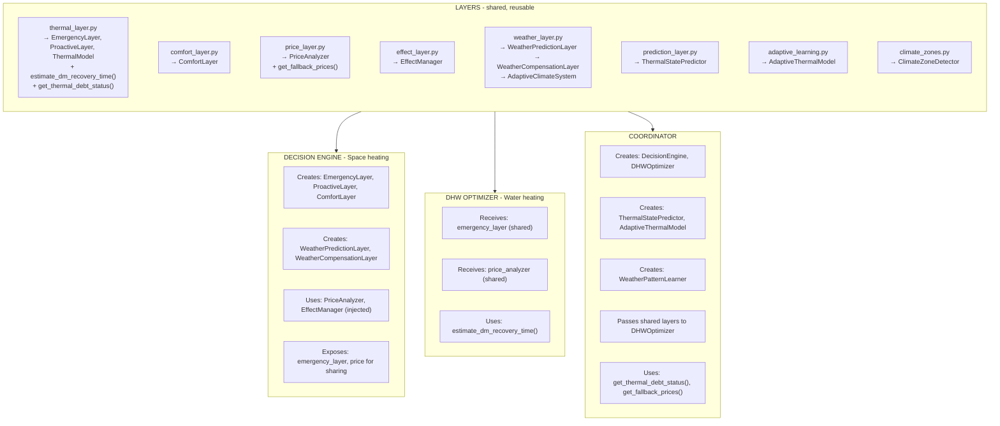

# EffektGuard Architecture Overview

This document provides a high-level overview of the EffektGuard system architecture and the detailed flow analysis documents in this folder.

## System Overview

EffektGuard is a sophisticated Swedish heat pump optimization system with these key components:
- **Multi-layer decision engine** with 9 priority layers
- **Native 15-minute spot price integration** for Swedish Effektavgift
- **Context-aware thermal debt prevention** (adapts to outdoor temperature)
- **Self-learning capabilities** with thermal prediction
- **Effect tariff peak protection** (monthly top-3 tracking)

## Architecture Documents

This folder contains detailed Mermaid diagrams showing how EffektGuard works in different scenarios:

1. **[01_normal_optimization_cycle.md](01_normal_optimization_cycle.md)** - Standard 5-minute optimization cycle
2. **[02_emergency_thermal_debt.md](02_emergency_thermal_debt.md)** - Context-aware emergency response + T2 thermal recovery damping
3. **[03_effect_tariff_protection.md](03_effect_tariff_protection.md)** - 15-minute peak avoidance
4. **[04_weather_preheating.md](04_weather_preheating.md)** - Predictive pre-heating
5. **[05_spot_price_optimization.md](05_spot_price_optimization.md)** - Spot price classification
6. **[06_learning_integration.md](06_learning_integration.md)** - Phase 6 self-learning
7. **[07_manual_override_services.md](07_manual_override_services.md)** - Service-based control
8. **[08_layer_priority_system.md](08_layer_priority_system.md)** - Decision aggregation
9. **[09_api_rate_limiting_analysis.md](09_api_rate_limiting_analysis.md)** - MyUplink API usage analysis
10. **[10_adaptive_climate_zones.md](10_adaptive_climate_zones.md)** - Latitude-based climate zone detection
11. **[11_airflow_optimization.md](11_airflow_optimization.md)** - Exhaust air heat pump ventilation optimization

## Key Architectural Insights

### 1. Context-Aware Safety System
- **Not fixed thresholds** - adapts degree minutes limits based on climate zone + outdoor temperature
- Stockholm (-10°C, Cold zone): Expects DM -450 to -700, warning at -700
- Kiruna (-25°C, Extreme Cold zone): Expects DM -900 to -1300, warning at -1300
- **Absolute maximum -1500 DM** never exceeded regardless of conditions
- **T2 thermal recovery damping** prevents overshoot when solar gain or natural warming detected

### 2. Native Swedish Integration
- **Spot price integration provides exactly 96 quarterly periods** (15-minute intervals)
- Perfect match for Swedish Effektavgift requirements
- Day/night weighting: Full effect 06:00-22:00, 50% weight 22:00-06:00

### 3. Multi-Layer Decision Engine
- **9 prioritized decision layers** with weighted aggregation
- Critical layers can override others (Safety 1.0, Effect up to 1.0)
- Advisory layers use dynamic weighted averaging (Emergency 0.8, Price 0.8, Weather 0.85, etc.)

### 4. Self-Learning Capabilities (Phase 6)
- **Thermal state predictor** learns building characteristics
- **Weather pattern learning** adapts to seasonal changes
- **Adaptive thermal model** adjusts thermal mass estimates
- Uses 672 observations (1 week) minimum for learning

### 5. Exhaust Air Heat Pump Optimization (F750/F730)
- **Airflow optimization** for exhaust air heat pumps
- Increases ventilation when compressor is struggling
- Net gain: +1.0 kW typical (heat extraction + COP improvement - ventilation penalty)
- Temperature-aware thresholds prevent use when outdoor penalty exceeds gains

## Layer Architecture

The optimization system uses a **shared layer architecture** where reusable layer components are created once and shared across consumers:

### Layer Sharing Flow

1. **Coordinator** creates `DecisionEngine` which instantiates space heating layers
2. **Coordinator** creates `ThermalStatePredictor`, `AdaptiveThermalModel`, `WeatherPatternLearner` separately
3. **DecisionEngine** exposes `emergency_layer` and `price` (PriceAnalyzer) as properties
4. **Coordinator** passes these shared instances to `DHWOptimizer`
5. **DHWOptimizer** uses shared layers to gate DHW during thermal debt

## Production Quality Features

The analysis reveals this is a **production-quality system** designed for real Swedish homes:

- **Multiple safety layers** with graceful degradation
- **Context-aware algorithms** that adapt from Malmö to Kiruna automatically
- **Research-based thresholds** from Swedish NIBE forums and real-world validation
- **Effect tariff optimization** with native quarterly precision
- **Manual override capabilities** for diagnostic and emergency use

The system balances cost optimization with heat pump health and comfort, using proven Swedish research and real-world validation.