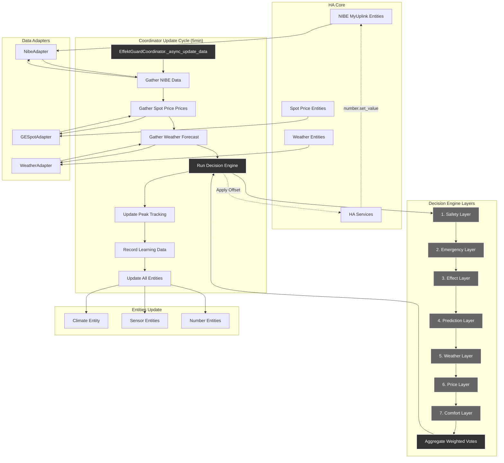

# Scenario 1: Normal Optimization Cycle

**Description**: Standard 5-minute optimization cycle with all systems operating normally.

## Flow Description

### 1. Data Collection (Every 5 minutes)
The coordinator orchestrates data gathering from three main sources:
- **NIBE MyUplink**: Heat pump state, temperatures, degree minutes
- **Spot Price**: Native 15-minute electricity prices (96 quarters/day)
- **Weather**: Forecast data for predictive optimization

### 2. Decision Engine Execution
The decision engine processes data through 7 prioritized layers:
1. **Safety Layer**: Hard temperature limits (18-24°C)
2. **Emergency Layer**: Context-aware thermal debt prevention
3. **Effect Layer**: 15-minute peak protection
4. **Prediction Layer**: Learned pre-heating (Phase 6)
5. **Weather Layer**: Weather-based pre-heating
6. **Price Layer**: Spot price optimization
7. **Comfort Layer**: Temperature error correction

### 3. Decision Aggregation
- Critical layers (weight 1.0) override all others
- Non-critical layers use weighted averaging
- Final offset applied via NIBE MyUplink entity

### 4. State Updates
All entities are updated with:
- Current optimization decision and reasoning
- Peak tracking information
- Learning data for Phase 6 capabilities
- Diagnostic information for monitoring

### 5. Learning Integration (Phase 6)
- Records observations for adaptive learning
- Updates thermal model parameters
- Saves learned data periodically
- Enhances future predictions

This cycle ensures continuous optimization while maintaining safety and providing full visibility into the decision-making process.