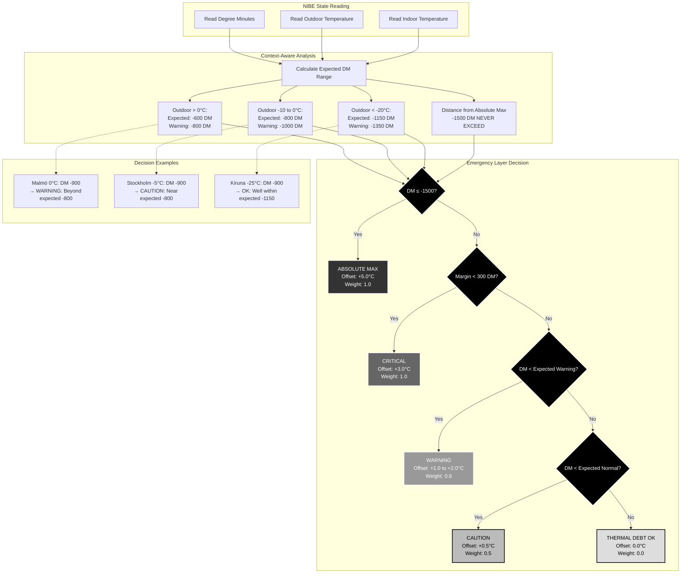

# Scenario 2: Emergency Thermal Debt Response

**Description**: Context-aware emergency response when degree minutes approach critical thresholds.



## Context-Aware Safety Philosophy

### Smart Adaptation vs Fixed Thresholds

Instead of using fixed degree minutes thresholds, EffektGuard employs **context-aware analysis** that understands what's "normal" for the current outdoor temperature:

- **At -30°C in Kiruna**: DM -1000 might be completely normal
- **At 0°C in Malmö**: DM -1000 indicates a serious problem

This approach automatically adapts to ANY Swedish climate without complex configuration.

### Temperature-Based Expected Ranges

The system calculates expected DM ranges based on outdoor temperature:

#### Mild Weather (> 0°C)
- **Expected normal**: -600 DM
- **Warning threshold**: -800 DM
- **Rationale**: Light heat demand, DM should stay shallow

#### Moderate Cold (0°C to -10°C)
- **Expected normal**: -800 DM
- **Warning threshold**: -1000 DM
- **Rationale**: Standard Swedish winter conditions

#### Cold Weather (-10°C to -20°C)
- **Expected normal**: -800 to -1000 DM (scales with temperature)
- **Warning threshold**: -1200 DM
- **Rationale**: Heavy heat demand, deeper DM expected

#### Extreme Cold (< -20°C)
- **Expected normal**: -1000 to -1150 DM
- **Warning threshold**: -1350 DM
- **Rationale**: Very heavy demand, very deep DM is normal

### Absolute Safety Limit

**DM -1500 is NEVER exceeded** regardless of outdoor temperature. This is the hard safety limit validated by Swedish NIBE forums and represents the point where heat pump damage becomes likely.

### Graduated Response System

The emergency layer provides graduated responses:

1. **ABSOLUTE MAX** (-1500 DM): Maximum emergency recovery (+5.0°C)
2. **CRITICAL** (within 300 DM of limit): Strong recovery (+3.0°C)
3. **WARNING** (beyond expected range): Moderate recovery (+1.0 to +2.0°C)
4. **CAUTION** (approaching expected limit): Gentle correction (+0.5°C)
5. **OK** (within normal range): No intervention (0.0°C)

This ensures the system responds appropriately to the severity of the thermal debt situation while accounting for normal operational variations in different climates.

## T2 Thermal Recovery Damping (Oct 20, 2025)

### The Concrete Slab Overshoot Problem

**Scenario**: T2 Critical recovery mode is active during cold night, struggling to maintain temperature with DM below -1000. Morning arrives, sun begins shining through windows, providing significant solar gain. Without intelligent damping, T2 continues pushing high offset (2.5°C) even as the house warms naturally. The concrete slab's thermal mass stores this excess heat, resulting in 2-3°C overshoot above target temperature hours later.

### Solution: Thermal Recovery Damping

T2 now monitors indoor temperature trends and intelligently reduces offset when natural warming is detected:

#### Damping Triggers
1. **Indoor warming rate**: ≥ 0.3°C/h (solar gain detected)
2. **Outdoor stability**: Not dropping rapidly (≥ -0.5°C/h)
3. **Trend confidence**: ≥ 0.4 (approximately 1 hour of reliable data)

#### Damping Factors
- **Moderate warming** (0.3-0.5°C/h): Reduce to 60% of T2 offset (2.5°C → 1.5°C)
- **Rapid warming** (>0.5°C/h): Reduce to 40% of T2 offset (2.5°C → 1.0°C, but minimum 1.5°C)

#### Safety Constraints
- **Minimum damped offset**: 1.5°C (never reduce below this safety threshold)
- **Cold spell protection**: No damping if outdoor dropping rapidly (fighting cold front)
- **Insufficient data**: No damping if trend confidence too low (< 0.4)

### Example: Night-to-Morning Transition

```
NIGHT (02:00, -10°C outdoor, 21.0°C indoor, DM -1100)
├─ Indoor trend: Stable/slowly cooling
├─ T2 Active: Full offset 2.5°C (aggressive recovery needed)
└─ Concrete slab receives full heating

MORNING (08:00, -8°C outdoor, 21.8°C indoor, DM -950)
├─ Indoor trend: Rising +0.5°C/h (solar gain detected)
├─ Outdoor trend: Warming +0.2°C/h (morning sun)
├─ T2 Damping Applied: Reduced to 1.5°C offset
└─ Result: Prevents +2-3°C overshoot, stays within comfort

IMPROVEMENT
├─ Without damping: House overshoots to 24-25°C by noon
├─ With damping: House stays 22-23°C (within target)
└─ Concrete slab doesn't store excess heat
```

### Integration with Multi-Tier System

Damping only applies to **T2 (CRITICAL Tier 2)**:
- **T1**: Less severe, standard offset (no damping needed)
- **T2**: Severe thermal debt, benefits from damping when warming detected
- **T3**: Near absolute maximum, no damping (full emergency recovery required)

This targeted approach ensures safety is never compromised while preventing overshoot in the most common recovery scenarios.