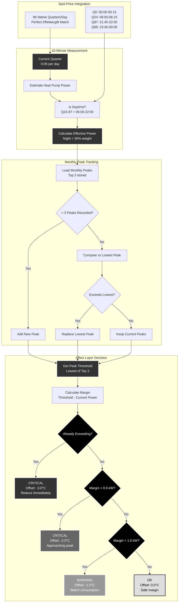

# Scenario 3: Effect Tariff Peak Protection

**Description**: 15-minute peak avoidance using Spot Price quarterly data and monthly top-3 tracking.

## Swedish Effektavgift Integration

### Perfect Quarter Alignment

EffektGuard leverages Spot Price's **native 15-minute data structure** which provides exactly 96 quarterly periods per day:

- **Q0**: 00:00-00:15 (Night, 50% weight)
- **Q24**: 06:00-06:15 (Daytime starts, full weight)
- **Q87**: 21:45-22:00 (Daytime ends, full weight)
- **Q95**: 23:45-00:00 (Night, 50% weight)

This matches the Swedish electricity market structure perfectly, eliminating the need for interpolation or approximation.

### Day/Night Weighting

Swedish Effektavgift applies different weights based on time of day:

- **Daytime (06:00-22:00)**: Full weight - these peaks cost more
- **Nighttime (22:00-06:00)**: 50% weight - reduced impact on bill

The system accounts for this when calculating effective power consumption and determining when to limit heat pump operation.

### Monthly Top-3 Peak Tracking

Swedish effect tariffs are typically based on the **top 3 peaks** in a billing period:

1. **Peak Detection**: Every 15-minute measurement is compared against stored peaks
2. **Replacement Logic**: New peaks replace the lowest of the current top 3
3. **Threshold Management**: The lowest peak becomes the threshold to avoid exceeding

### Graduated Response System

The effect layer provides four levels of response based on proximity to creating a new peak:

#### Already Exceeding Threshold
- **Action**: CRITICAL - Offset -3.0°C
- **Rationale**: We're already creating a new peak, aggressive reduction needed

#### Within 0.5 kW of Threshold  
- **Action**: CRITICAL - Offset -2.0°C
- **Rationale**: Very close to peak, prevent exceedance

#### Within 1.0 kW of Threshold
- **Action**: WARNING - Offset -1.0°C  
- **Rationale**: Approaching danger zone, moderate reduction

#### Safe Margin (> 1.0 kW)
- **Action**: OK - Offset 0.0°C
- **Rationale**: Sufficient margin, no action needed

### Power Estimation

The system estimates heat pump power consumption from NIBE state data:

1. **Direct Power Sensor**: Most accurate if available
2. **NIBE Power Entity**: Auto-discovered heat pump power
3. **Temperature-Based Estimation**: Fallback using supply/outdoor temps

Estimation accounts for:
- Outdoor temperature (colder = more power)
- Supply temperature (higher flow = more power)
- Compressor status (on/off/modulating)

### Real-Time Quarter Tracking

Every coordinator update (5-minute intervals) performs multiple quarter measurements to ensure no peaks are missed:

- Current quarter identification (0-95)
- Power estimation at that moment
- Comparison against peak thresholds
- Immediate response if needed

This provides near real-time protection against creating new effect tariff peaks while maintaining optimal heat pump operation during safe periods.