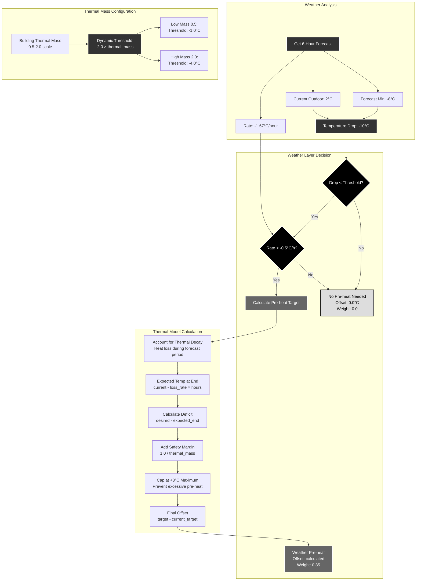

# Scenario 4: Weather-Based Pre-heating

**Description**: Predictive pre-heating before cold periods using thermal modeling.



## Weather-Based Predictive Strategy

### Dynamic Threshold Adaptation

The weather layer uses **building-specific thermal mass** to determine when pre-heating is beneficial:

#### Low Thermal Mass Buildings (0.5)
- **Characteristics**: Timber frame, poor insulation
- **Threshold**: -1.0°C temperature drop
- **Rationale**: Fast heat loss, need early pre-heating

#### Normal Thermal Mass Buildings (1.0)  
- **Characteristics**: Standard construction
- **Threshold**: -2.0°C temperature drop
- **Rationale**: Balanced approach

#### High Thermal Mass Buildings (2.0)
- **Characteristics**: Concrete, excellent insulation  
- **Threshold**: -4.0°C temperature drop
- **Rationale**: Good heat retention, less pre-heating needed

### Two-Condition Pre-heating Logic

Pre-heating activates only when **both conditions** are met:

1. **Significant Temperature Drop**: Forecast drop exceeds dynamic threshold
2. **Rapid Cooling Rate**: Temperature falling faster than -0.5°C/hour

This prevents unnecessary pre-heating during:
- Gradual cooling (building can adapt naturally)
- Small temperature variations (thermal mass handles it)
- Forecast uncertainties (avoid overreaction)

### Thermal Decay Modeling

The pre-heating calculation accounts for **heat loss during the forecast period**:

#### Step 1: Calculate Heat Loss Rate
```
heat_loss_rate = temperature_difference / (insulation_quality × 10)
```

#### Step 2: Project End Temperature  
```
expected_temp_end = current_temp - (heat_loss_rate × forecast_hours)
```

#### Step 3: Calculate Required Pre-heating
```
deficit = desired_temp - expected_temp_end
safety_margin = 1.0 / thermal_mass
target_temp = desired_temp + deficit + safety_margin
```

#### Step 4: Apply Limits
```
final_target = min(target_temp, desired_temp + 3.0)  // Cap at +3°C
offset = final_target - current_target_temp
```

### Safety Mechanisms

#### Maximum Pre-heat Limit
Pre-heating is capped at **+3.0°C above normal target** to prevent:
- Excessive energy consumption
- Thermal debt accumulation
- Overheating during forecast errors

#### Thermal Mass-Based Safety Margin
Higher thermal mass buildings get **smaller safety margins**:
- Low mass (0.5): 2.0°C safety margin
- Normal mass (1.0): 1.0°C safety margin  
- High mass (2.0): 0.5°C safety margin

This reflects their ability to store and retain heat effectively.

### Integration with Other Layers

The weather layer (weight 0.85) works in coordination with:

- **Price Layer (0.8)**: Pre-heat preferentially during cheap periods
- **Effect Layer (0.65-1.0)**: Avoid pre-heating if it would create peaks
- **Emergency Layer (0.8)**: Skip pre-heating if thermal debt is critical

### Forecast Window Optimization

The **6-hour forecast window** balances:
- **Prediction accuracy**: Shorter forecasts are more reliable
- **Pre-heating effectiveness**: Sufficient time for thermal preparation
- **Energy efficiency**: Avoid excessive advance heating

This window works well with typical Swedish weather patterns and building thermal characteristics.

### Example Scenario

**Current Conditions**:
- Outdoor: 2°C, Indoor: 21°C target
- 6-hour forecast minimum: -8°C (-10°C drop)
- Rate: -1.67°C/hour
- Building: Normal thermal mass (1.0)

**Decision Process**:
1. Drop (-10°C) > threshold (-2.0°C) ✓
2. Rate (-1.67°C/h) < -0.5°C/h ✓
3. Expected end temp: 21°C - heat_loss = ~19°C
4. Deficit: 21°C - 19°C = 2°C
5. Safety margin: 1.0°C
6. Target: 21°C + 2°C + 1°C = 24°C
7. Final offset: +3.0°C (capped)

**Result**: Weather layer votes for +3.0°C pre-heating with weight 0.85