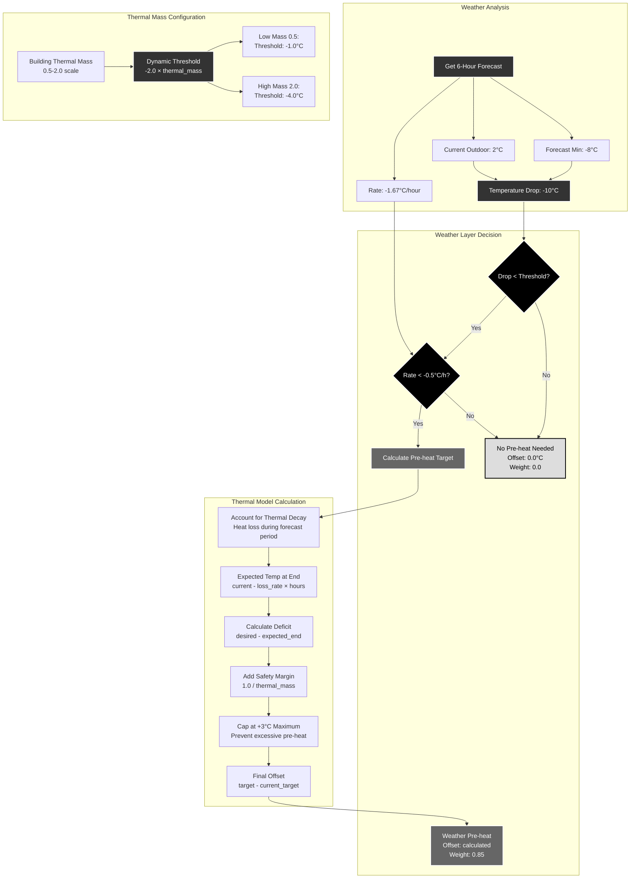

# Scenario 4: Weather-Based Pre-heating

**Description**: Predictive pre-heating before cold periods using thermal modeling.


```mermaid
flowchart TD
    subgraph "Weather Analysis"
        A[Get 6-Hour Forecast]
        B[Current Outdoor: 2°C]
        C[Forecast Min: -8°C]
        D[Temperature Drop: -10°C]
        E[Rate: -1.67°C/hour]
    end

    subgraph "Thermal Mass Configuration"
        F[Building Thermal Mass<br/>0.5-2.0 scale]
        G[Dynamic Threshold<br/>-2.0 × thermal_mass]
        H[Low Mass 0.5:<br/>Threshold: -1.0°C]
        I[High Mass 2.0:<br/>Threshold: -4.0°C]
    end

    subgraph "Weather Layer Decision"
        J{Drop < Threshold?}
        K{Rate < -0.5°C/h?}
        L[Calculate Pre-heat Target]
        M[Weather Pre-heat<br/>Offset: calculated<br/>Weight: 0.85]
        N[No Pre-heat Needed<br/>Offset: 0.0°C<br/>Weight: 0.0]
    end

    subgraph "Thermal Model Calculation"
        O[Account for Thermal Decay<br/>Heat loss during forecast period]
        P[Expected Temp at End<br/>current - loss_rate × hours]
        Q[Calculate Deficit<br/>desired - expected_end]
        R[Add Safety Margin<br/>1.0 / thermal_mass]
        S[Cap at +3°C Maximum<br/>Prevent excessive pre-heat]
        T[Final Offset<br/>target - current_target]
    end

    %% Flow
    A --> B
    A --> C
    B --> D
    C --> D
    A --> E
    
    F --> G
    G --> H
    G --> I
    
    D --> J
    E --> K
    J -->|Yes| K
    K -->|Yes| L
    K -->|No| N
    J -->|No| N
    
    L --> O
    O --> P
    P --> Q
    Q --> R
    R --> S
    S --> T
    T --> M

    %% Styling
    style A fill:#333,stroke:#fff,stroke-width:2px,color:#fff
    style D fill:#333,stroke:#fff,stroke-width:2px,color:#fff
    style G fill:#333,stroke:#fff,stroke-width:2px,color:#fff
    
    style J fill:#000,stroke:#fff,stroke-width:2px,color:#fff
    style K fill:#000,stroke:#fff,stroke-width:2px,color:#fff
    
    style L fill:#666,stroke:#fff,stroke-width:2px,color:#fff
    style M fill:#666,stroke:#fff,stroke-width:2px,color:#fff
    style N fill:#ddd,stroke:#000,stroke-width:2px,color:#000
```

## Weather-Based Predictive Strategy

### Dynamic Threshold Adaptation

The weather layer uses **building-specific thermal mass** to determine when pre-heating is beneficial:

#### Low Thermal Mass Buildings (0.5)
- **Characteristics**: Timber frame, poor insulation
- **Threshold**: -1.0°C temperature drop
- **Rationale**: Fast heat loss, need early pre-heating

#### Normal Thermal Mass Buildings (1.0)  
- **Characteristics**: Standard construction
- **Threshold**: -2.0°C temperature drop
- **Rationale**: Balanced approach

#### High Thermal Mass Buildings (2.0)
- **Characteristics**: Concrete, excellent insulation  
- **Threshold**: -4.0°C temperature drop
- **Rationale**: Good heat retention, less pre-heating needed

### Two-Condition Pre-heating Logic

Pre-heating activates only when **both conditions** are met:

1. **Significant Temperature Drop**: Forecast drop exceeds dynamic threshold
2. **Rapid Cooling Rate**: Temperature falling faster than -0.5°C/hour

This prevents unnecessary pre-heating during:
- Gradual cooling (building can adapt naturally)
- Small temperature variations (thermal mass handles it)
- Forecast uncertainties (avoid overreaction)

### The Actual Algorithm

> ⚠️ **This section used to describe a thermal-decay model that does not exist.** It documented a
> `heat_loss_rate`, an `expected_temp_end`, a `deficit`, a `1.0 / thermal_mass` safety margin, a
> `-2.0 × thermal_mass` dynamic threshold and a +3.0 °C cap. **Not one of those variables is in
> `weather_layer.py`.** Its worked example concluded "+3.0 °C", overstating the layer's authority
> by 3.6× against the +0.83 the code actually emitted at the time. What follows is the code.

`WeatherPredictionLayer.evaluate_layer()` is deliberately simple: it decides **whether** to
pre-heat, not **how much**. The amount is a constant.

```python
# 1. Look ahead as far as this building's thermal mass justifies.
#    6 h radiators / 12 h timber UFH / 24 h concrete slab, floored at WEATHER_FORECAST_HORIZON.
forecast_hours = weather_data.forecast_hours[: int(self.forecast_horizon)]

# 2. The coldest hour in that window, relative to now.
temp_drop = min(f.temperature for f in forecast_hours) - nibe_state.outdoor_temp

# 3. Two independent triggers - either fires the layer.
forecast_triggered = temp_drop <= WEATHER_FORECAST_DROP_THRESHOLD      # -4.0 °C
indoor_cooling = (trend_rate <= WEATHER_INDOOR_COOLING_CONFIRMATION    # -0.5 °C/h
                  and trend_confidence > 0.4)

if forecast_triggered or indoor_cooling:
    return WeatherLayerDecision(
        offset=WEATHER_PREHEAT_OFFSET,                                  # +2.0 °C, a constant
        weight=min(LAYER_WEIGHT_WEATHER_PREDICTION * thermal_mass, WEATHER_WEIGHT_CAP),
    )
```

**The horizon must follow the thermal mass, and this is not cosmetic.** A concrete slab does not
get into thermal debt from a sudden plunge — the pump's own curve is reactive but fast, and
catches that. It gets into debt from a slow, deep slide, and a fixed 12-hour window cannot see one:

| cold snap | drop within 12 h | fires? | drop within 24 h | fires? |
|---|---|---|---|---|
| 15 °C over 6 h (plunge) | −15.0 °C | yes | −15.0 °C | yes |
| 15 °C over 48 h (two days) | **−3.8 °C** | **NO** | −7.5 °C | yes |
| 20 °C over 72 h (three days) | **−3.3 °C** | **NO** | −6.7 °C | yes |

Within any twelve hours of a two-day slide the temperature falls less than the four degrees needed
to trigger, so the pre-heat **never fired** — while the sudden plunge, which *did* trigger it, is
the case that needed it least. See audit F-130.

### Safety Mechanisms

#### The pre-heat is bounded by construction
`WEATHER_PREHEAT_OFFSET` is **+2.0 °C**, and it is sized, not tuned: the fabric must reach the edge
of `THERMAL_BATTERY_BAND` (±1.0 °C) **within the horizon the house is given**, or the pre-heat is
decoration. On the simulator's validated plant models the previous +0.83 took **28.4 h** (radiator)
and **34.6 h** (concrete slab) to fill that band, against horizons of 12 h and 24 h. It could never
charge the battery before the cold arrived. At +2.0 it takes 9.6 h and 14.8 h — both inside. See
audit F-130 and `tests/unit/optimization/test_preheat_can_actually_charge_the_house.py`.

It cannot cook the house: the comfort layer takes charge at the edge of the storage band, and
+2.0 sits within `WEATHER_COMP_MAX_OFFSET` (3.0), the bound placed on every weather-driven
correction.

#### Weight scales with thermal mass
```
weight = min(LAYER_WEIGHT_WEATHER_PREDICTION × thermal_mass, WEATHER_WEIGHT_CAP)
```
A heavy building both needs more warning and can store more, so its pre-heat vote carries further.
The cap keeps it below the Safety layer.

This reflects their ability to store and retain heat effectively.

### Integration with Other Layers

The weather layer (weight 0.85) works in coordination with:

- **Price Layer (0.8)**: Pre-heat preferentially during cheap periods
- **Effect Layer (0.65-1.0)**: Avoid pre-heating if it would create peaks
- **Emergency Layer (0.8)**: Skip pre-heating if thermal debt is critical

### Forecast Window Optimization

The **6-hour forecast window** balances:
- **Prediction accuracy**: Shorter forecasts are more reliable
- **Pre-heating effectiveness**: Sufficient time for thermal preparation
- **Energy efficiency**: Avoid excessive advance heating

This window works well with typical Swedish weather patterns and building thermal characteristics.

### Example Scenario

**Current Conditions**:
- Outdoor: 2°C, Indoor: 21°C target
- 6-hour forecast minimum: -8°C (-10°C drop)
- Rate: -1.67°C/hour
- Building: Normal thermal mass (1.0)

**Decision Process**:
1. Drop (-10°C) > threshold (-2.0°C) ✓
2. Rate (-1.67°C/h) < -0.5°C/h ✓
3. Expected end temp: 21°C - heat_loss = ~19°C
4. Deficit: 21°C - 19°C = 2°C
5. Safety margin: 1.0°C
6. Target: 21°C + 2°C + 1°C = 24°C
7. Final offset: +3.0°C (capped)

**Result**: Weather layer votes for +3.0°C pre-heating with weight 0.85