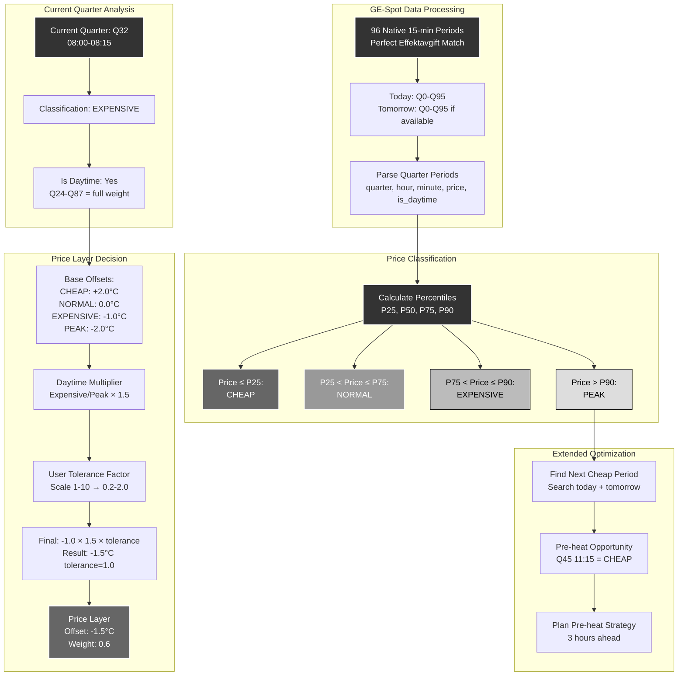

# Scenario 5: Spot Price Optimization with GE-Spot

**Description**: Base optimization using native 15-minute GE-Spot price classification.



## GE-Spot Native Integration

### Perfect Quarter Alignment

GE-Spot provides **exactly 96 quarterly periods per day**, eliminating the need for:
- Hourly price interpolation
- Complex time zone calculations  
- Approximation errors

Each quarter maps directly to Swedish Effektavgift measurement windows:
- **Q0-Q23**: 00:00-06:00 (Night, 50% effect weight)
- **Q24-Q87**: 06:00-22:00 (Day, full effect weight)
- **Q88-Q95**: 22:00-00:00 (Night, 50% effect weight)

### Dynamic Price Classification

Rather than fixed price thresholds, the system uses **percentile-based classification**:

#### Daily Price Distribution Analysis
1. **Collect all 96 prices** for the day
2. **Calculate percentiles**: P25, P50, P75, P90
3. **Classify each quarter** relative to the day's distribution

#### Classification Bands
- **CHEAP (≤P25)**: Bottom 25% of prices - pre-heating opportunity
- **NORMAL (P25-P75)**: Middle 50% of prices - maintain status quo
- **EXPENSIVE (P75-P90)**: Top 25-10% of prices - reduce consumption
- **PEAK (>P90)**: Top 10% of prices - minimize consumption

This approach automatically adapts to:
- Seasonal price variations
- Market volatility
- Regional price differences
- Supply/demand fluctuations

### Base Offset Strategy

Each classification has a **base offset value**:

```
CHEAP: +2.0°C    # Pre-heat opportunity
NORMAL: 0.0°C    # Neutral operation
EXPENSIVE: -1.0°C # Reduce consumption  
PEAK: -2.0°C     # Minimize consumption
```

### Day/Night Multiplier

During **daytime hours (Q24-Q87)**, expensive and peak periods get amplified:
- **Expensive**: -1.0°C × 1.5 = -1.5°C
- **Peak**: -2.0°C × 1.5 = -3.0°C

**Rationale**: Daytime consumption has full effect tariff weight, making reductions more valuable.

### User Tolerance Scaling

The **tolerance setting (1-10 scale)** allows users to control optimization aggressiveness:

```
tolerance_factor = user_tolerance / 5.0  # Range: 0.2-2.0

final_offset = base_offset × daytime_multiplier × tolerance_factor
```

#### Tolerance Examples
- **Tolerance 1**: Very conservative (0.2× scaling)
- **Tolerance 5**: Balanced (1.0× scaling)  
- **Tolerance 10**: Aggressive (2.0× scaling)

### Extended Optimization Horizon

When **tomorrow's prices are available**, the system can:

1. **Find next cheap period** across today + tomorrow
2. **Plan extended pre-heating** before expensive periods
3. **Optimize 48-hour strategy** rather than just current quarter

### Example Price Day Analysis

**Sample Day Prices** (SEK/kWh):
- **Minimum**: 0.85 (night)
- **P25**: 1.20 (cheap threshold)
- **P50**: 1.45 (median)
- **P75**: 1.75 (expensive threshold)  
- **P90**: 2.10 (peak threshold)
- **Maximum**: 2.45 (evening peak)

**Q32 (08:00-08:15)**: Price 1.80 SEK/kWh
- **Classification**: EXPENSIVE (1.80 > 1.75)
- **Is Daytime**: Yes (Q32 in Q24-Q87 range)
- **Base Offset**: -1.0°C
- **Daytime Multiplier**: 1.5×
- **Tolerance Factor**: 1.0 (user setting 5)
- **Final Offset**: -1.0 × 1.5 × 1.0 = **-1.5°C**

### Integration with Other Layers

The price layer (weight 0.6) coordinates with:

- **Effect Layer (1.0)**: Don't pre-heat during cheap periods if it creates peaks
- **Weather Layer (0.7)**: Prioritize cheap periods for weather-based pre-heating  
- **Comfort Layer (0.2-0.5)**: Balance cost savings with temperature maintenance

This ensures cost optimization never compromises safety or creates unacceptable comfort deviations.