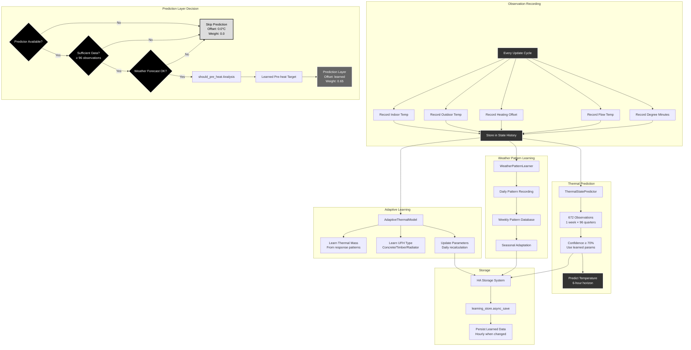

# Scenario 6: Phase 6 Learning Integration

**Description**: Self-learning thermal prediction and adaptive behavior.



## Self-Learning Architecture

### Three Learning Modules

Phase 6 implements **three complementary learning systems**:

#### 1. AdaptiveThermalModel
- **Purpose**: Learn building-specific thermal characteristics
- **Input**: Indoor/outdoor temps, heating offsets, response patterns
- **Output**: Refined thermal mass and UFH type estimates
- **Update Frequency**: Daily recalculation

#### 2. ThermalStatePredictor  
- **Purpose**: Predict temperature evolution based on learned behavior
- **Input**: 672 observations (1 week × 96 quarters)
- **Output**: 6-hour temperature predictions with confidence levels
- **Threshold**: 70% confidence required for activation

#### 3. WeatherPatternLearner
- **Purpose**: Adapt to seasonal weather patterns
- **Input**: Daily temperature patterns from forecasts
- **Output**: Seasonal adaptation factors
- **Database**: Weekly pattern storage with seasonal trends

### Observation Recording System

Every **5-minute coordinator update** records:

```python
Observation = {
    timestamp: datetime,
    indoor_temp: float,      # °C
    outdoor_temp: float,     # °C  
    heating_offset: float,   # °C applied
    flow_temp: float,        # °C supply temp
    degree_minutes: float    # Current DM value
}
```

These observations build the **state history** used for learning.

### Adaptive Thermal Model Learning

#### Thermal Mass Discovery
Analyzes **temperature response patterns** to heating changes:

- **Fast Response**: Low thermal mass (timber, poor insulation)
- **Slow Response**: High thermal mass (concrete, good insulation)
- **Mixed Response**: Standard construction

#### UFH Type Classification  
Determines underfloor heating characteristics:

- **Concrete Slab**: 6+ hour thermal lag
- **Timber UFH**: 2-3 hour lag  
- **Radiator**: <1 hour response

#### Parameter Updates
**Daily recalculation** refines:
```python
learned_params = {
    thermal_mass: 0.5-2.0,        # Relative scale
    ufh_type: "concrete_slab",    # Detected type
    response_time: hours,         # Time to temperature change
    efficiency_factor: 0.8-1.2    # Heat pump effectiveness
}
```

### Thermal State Prediction

#### Data Requirements
- **Minimum**: 96 observations (24 hours)
- **Optimal**: 672 observations (1 week)
- **Confidence**: ≥70% required for predictions

#### Prediction Horizon
**6-hour forecasts** balance:
- **Accuracy**: Shorter predictions more reliable
- **Usefulness**: Sufficient time for pre-heating decisions
- **Computational Cost**: Manageable calculation complexity

#### Should Pre-heat Analysis
The predictor evaluates:

1. **Target Achievement**: Can we reach target temp naturally?
2. **Thermal Decay**: Will we lose too much heat during forecast period?
3. **Pre-heat Benefit**: Will pre-heating improve outcomes?
4. **Energy Efficiency**: Is the energy cost justified?

### Weather Pattern Learning

#### Daily Pattern Capture
Records **24-hour temperature profiles** from weather forecasts:
```python
daily_pattern = [
    temp_00, temp_01, ..., temp_23  # Hourly temperatures
]
```

#### Weekly Database
Builds **pattern database** with:
- Daily temperature profiles
- Seasonal trends
- Weather type classification (clear, cloudy, precipitation)
- Prediction accuracy tracking

#### Seasonal Adaptation
Adjusts thresholds based on **learned seasonal patterns**:
- Winter: More aggressive pre-heating
- Summer: Gentler optimization  
- Shoulder seasons: Balanced approach

### Prediction Layer Decision Logic

```python
def prediction_layer_decision():
    if not predictor_available:
        return skip_prediction()
    
    if observations < 96:
        return insufficient_data()
    
    if not weather_forecast:
        return no_forecast()
    
    preheat_decision = predictor.should_pre_heat(
        target_temp=21.0,
        hours_ahead=6,
        outdoor_forecast=forecast_temps
    )
    
    if preheat_decision.should_preheat:
        return LayerDecision(
            offset=preheat_decision.recommended_offset,
            weight=0.65,  # Higher than price (0.6), lower than weather (0.7)
            reason=preheat_decision.reason
        )
    
    return no_preheat_needed()
```

### Storage and Persistence

#### Home Assistant Storage API
Uses **HA's built-in storage system**:
```python
learning_store = Store(hass, version=1, key="effektguard_learned_data")
```

#### Persistence Strategy
- **Save Frequency**: Hourly when data changes
- **Storage Format**: JSON with versioning
- **Data Included**: All learned parameters, observation counts, confidence levels

#### Data Structure
```json
{
    "version": 1,
    "last_updated": "2024-01-15T10:30:00Z",
    "thermal_model": {
        "thermal_mass": 1.2,
        "ufh_type": "concrete_slab",
        "learned_parameters": {...},
        "observation_count": 1440
    },
    "thermal_predictor": {
        "responsiveness": 0.85,
        "state_count": 672,
        "confidence": 0.78
    },
    "weather_patterns": {
        "database_summary": {...},
        "seasonal_factors": {...}
    }
}
```

### Integration with Decision Engine

The **Prediction Layer** (weight 0.65) fits between:
- **Weather Layer** (0.7): Higher priority for immediate weather threats
- **Price Layer** (0.6): Lower priority than learned building behavior

This ensures **learned pre-heating** takes precedence over simple price optimization while still yielding to immediate weather-based needs.

### Learning Confidence System

#### Confidence Thresholds
- **<70%**: Skip learned predictions, use generic thermal model
- **70-85%**: Use learned predictions with caution
- **>85%**: High confidence, rely on learned behavior

#### Confidence Factors
```python
confidence = min(
    observation_count / 672,        # Data quantity
    prediction_accuracy,            # Historical accuracy
    parameter_stability,            # Consistency over time
    seasonal_adaptation_factor      # Seasonal appropriateness
)
```

This graduated confidence system ensures the learning system **improves optimization gradually** without making dangerous assumptions from insufficient data.