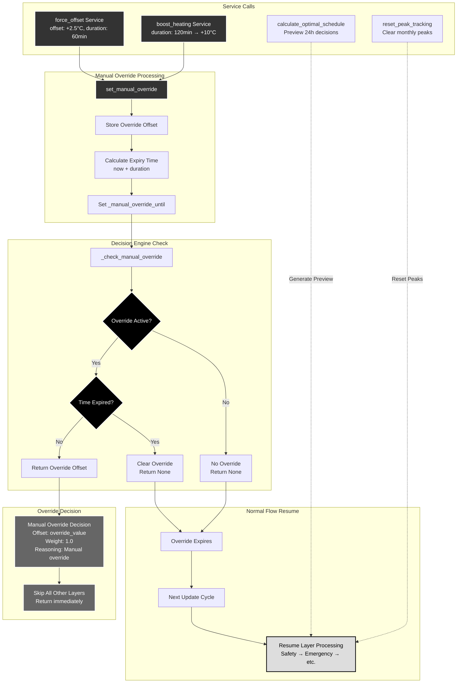

# Scenario 7: Manual Override Services (Phase 5)

**Description**: Service-based manual control with time-based expiration.



## Manual Override System

### Service-Based Control

Phase 5 implements **four manual services** for user control and diagnostics:

#### 1. force_offset Service
```yaml
service: effektguard.force_offset
data:
  offset: 2.5        # °C (-10 to +10)
  duration: 60       # minutes (0-480)
```
- **Purpose**: Manual heating curve override
- **Use Cases**: Testing, temporary adjustments, comfort boost
- **Duration**: 0 = until next cycle, max 8 hours

#### 2. boost_heating Service  
```yaml
service: effektguard.boost_heating
data:
  duration: 120      # minutes (30-360)
```
- **Purpose**: Emergency comfort boost (maximum heating)
- **Behavior**: Applies +10°C offset for specified duration
- **Use Cases**: Rapid recovery, unexpected cold, guest comfort

#### 3. calculate_optimal_schedule Service
```yaml
service: effektguard.calculate_optimal_schedule
```
- **Purpose**: Preview 24-hour optimization decisions
- **Returns**: Hourly forecast with offsets, reasoning, prices
- **Use Cases**: Planning, troubleshooting, understanding behavior

#### 4. reset_peak_tracking Service
```yaml  
service: effektguard.reset_peak_tracking
```
- **Purpose**: Clear monthly peak history
- **Use Cases**: New billing period, system reset, testing
- **Effect**: Resets top-3 peak tracking, clears effect tariff memory

### Override Processing Logic

#### State Management
```python
class DecisionEngine:
    def __init__(self):
        self._manual_override_offset: float | None = None
        self._manual_override_until: datetime | None = None
    
    def set_manual_override(self, offset: float, duration_minutes: int):
        self._manual_override_offset = offset
        if duration_minutes > 0:
            self._manual_override_until = now() + timedelta(minutes=duration_minutes)
        else:
            self._manual_override_until = None  # Until next cycle
```

#### Time-Based Expiration
```python
def _check_manual_override(self) -> float | None:
    if self._manual_override_offset is None:
        return None
    
    # Check time-based expiration
    if self._manual_override_until:
        if now() >= self._manual_override_until:
            self.clear_manual_override()
            return None
    
    return self._manual_override_offset
```

### Decision Engine Integration

#### Priority Override
Manual overrides have **absolute priority** in the decision engine:

```python
def calculate_decision(self, nibe_state, price_data, weather_data, current_peak):
    # Check manual override FIRST
    manual_override = self._check_manual_override()
    if manual_override is not None:
        return OptimizationDecision(
            offset=manual_override,
            layers=[LayerDecision(
                offset=manual_override,
                weight=1.0,
                reason=f"Manual override: {manual_override:.1f}°C"
            )],
            reasoning=f"Manual override active: {manual_override:.1f}°C"
        )
    
    # Continue with normal layer processing...
```

#### Complete Layer Bypass
When manual override is active:
- **All 7 layers are skipped** (Safety, Emergency, Effect, etc.)
- **No calculations performed** (saves CPU, avoids conflicts)
- **Single decision returned** with weight 1.0
- **Clear reasoning provided** for transparency

### Service Validation

#### Input Validation
```python
# force_offset validation
force_offset_schema = vol.Schema({
    vol.Required("offset"): vol.All(
        vol.Coerce(float), 
        vol.Range(min=-10.0, max=10.0)  # Safety limits
    ),
    vol.Optional("duration", default=60): vol.All(
        vol.Coerce(int), 
        vol.Range(min=0, max=480)  # Max 8 hours
    ),
})

# boost_heating validation  
boost_heating_schema = vol.Schema({
    vol.Optional("duration", default=120): vol.All(
        vol.Coerce(int),
        vol.Range(min=30, max=360)  # 30min - 6 hours
    ),
})
```

#### Safety Constraints
- **Offset limits**: -10°C to +10°C (hardware safety)
- **Duration limits**: Maximum 8 hours (prevent indefinite override)
- **Rate limiting**: Minimum 5 minutes between NIBE writes
- **Coordinator availability**: Services fail gracefully if coordinator unavailable

### Calculate Optimal Schedule

#### 24-Hour Preview Generation
```python
async def calculate_optimal_schedule_handler(call):
    schedule = []
    current_time = datetime.now()
    
    for hour_offset in range(24):
        forecast_time = current_time + timedelta(hours=hour_offset)
        quarter = (forecast_time.hour * 4) + (forecast_time.minute // 15)
        
        # Get price classification for this quarter
        if quarter < len(price_data.today):
            period = price_data.today[quarter]
            classification = price_analyzer.get_current_classification(quarter)
        else:
            # Use tomorrow's data if available
            # ... tomorrow logic
        
        # Calculate estimated decision for this time
        estimated_offset = price_analyzer.get_base_offset(
            quarter % 96, classification, period.is_daytime
        )
        
        schedule.append({
            "time": forecast_time.strftime("%Y-%m-%d %H:%M"),
            "hour": hour_offset,
            "quarter": quarter % 96,
            "classification": classification,
            "estimated_offset": round(estimated_offset, 2),
            "price": round(period.price, 3) if period else None,
            "is_daytime": period.is_daytime if period else None,
        })
    
    return {"schedule": schedule, "generated_at": current_time.isoformat()}
```

#### Schedule Response Format
```json
{
    "schedule": [
        {
            "time": "2024-01-15 14:30",
            "hour": 0,
            "quarter": 58,
            "classification": "expensive", 
            "estimated_offset": -1.5,
            "price": 1.847,
            "is_daytime": true
        },
        // ... 23 more hours
    ],
    "generated_at": "2024-01-15T14:30:00"
}
```

### Peak Tracking Reset

#### Monthly Peak Management
```python
async def reset_peak_tracking_handler(call):
    coordinator = get_coordinator(hass)
    
    # Reset peaks in effect manager
    coordinator.effect.reset_monthly_peaks()
    
    # Save cleared state
    await coordinator.effect.async_save()
    
    # Update coordinator data immediately
    await coordinator.async_request_refresh()
```

#### Use Cases
- **New billing period**: Clear previous month's peaks
- **System testing**: Reset to baseline for testing
- **Configuration changes**: Fresh start after system changes
- **Troubleshooting**: Clear potentially corrupt peak data

### Error Handling

#### Graceful Degradation
```python
def get_coordinator(hass: HomeAssistant) -> EffektGuardCoordinator | None:
    domain_data = hass.data.get(DOMAIN, {})
    for coordinator in domain_data.values():
        if isinstance(coordinator, EffektGuardCoordinator):
            return coordinator
    return None

async def service_handler(call):
    coordinator = get_coordinator(hass)
    if not coordinator:
        _LOGGER.error("No EffektGuard coordinator found")
        return  # Fail gracefully
```

#### Service Response Handling
- **Success**: Normal completion, immediate coordinator refresh
- **Validation Error**: Clear error message, no state change
- **System Error**: Logged error, system continues normal operation
- **Timeout**: Service completes, but warns of potential delay

This robust service system provides **manual control without compromising safety** while maintaining full integration with the automated optimization system.