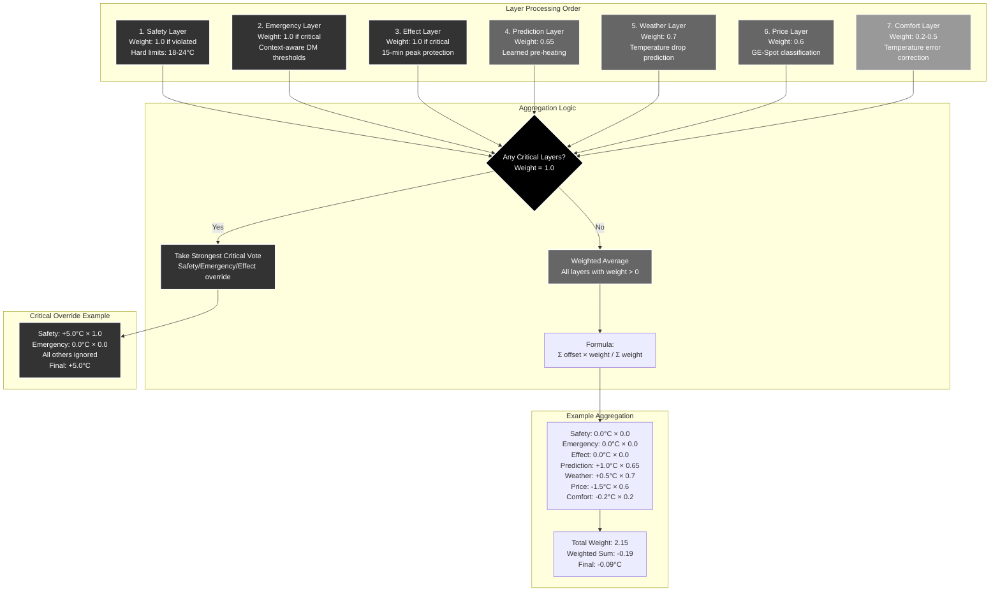

# Layer Priority and Weight System

**Description**: How the 7-layer decision engine aggregates votes with priorities.



## Decision Engine Architecture

### Seven-Layer Hierarchy

The decision engine processes layers in **strict priority order**:

#### Critical Layers (Weight 1.0)
These layers can **completely override** all other considerations:

1. **Safety Layer**: Absolute temperature limits (18-24°C indoor)
2. **Emergency Layer**: Thermal debt prevention (context-aware DM thresholds) 
3. **Effect Layer**: Peak protection (15-minute effect tariff avoidance)

#### Advisory Layers (Weight < 1.0)
These layers **contribute to weighted decisions**:

4. **Prediction Layer (0.65)**: Learned pre-heating from Phase 6 thermal predictor
5. **Weather Layer (0.7)**: Weather-based pre-heating before cold periods
6. **Price Layer (0.6)**: GE-Spot price optimization (base layer)
7. **Comfort Layer (0.2-0.5)**: Temperature error correction and drift prevention

### Aggregation Algorithm

#### Critical Layer Override
```python
def _aggregate_layers(self, layers: list[LayerDecision]) -> float:
    # Separate critical layers (weight = 1.0)
    critical_layers = [layer for layer in layers if layer.weight >= 1.0]
    
    if critical_layers:
        # Take the strongest critical vote
        max_offset = max(layer.offset for layer in critical_layers)
        min_offset = min(layer.offset for layer in critical_layers)
        
        # Choose more conservative (safety-oriented) option
        if abs(max_offset) > abs(min_offset):
            return max_offset
        else:
            return min_offset
```

#### Weighted Average Calculation
```python
    # Otherwise, weighted average of all layers
    total_weight = sum(layer.weight for layer in layers)
    if total_weight == 0:
        return 0.0
    
    weighted_sum = sum(layer.offset * layer.weight for layer in layers)
    return weighted_sum / total_weight
```

### Layer Weight Rationale

#### Critical Layers (1.0)
- **Safety**: Human comfort and system protection
- **Emergency**: Heat pump damage prevention  
- **Effect**: Financial protection (peak avoidance)

**Design Philosophy**: These concerns are **non-negotiable** and override all cost optimization.

#### Weather Layer (0.7)
- **Higher than price optimization** (0.6)
- **Rationale**: Weather changes are predictable and pre-heating is time-sensitive
- **Balances**: Immediate weather needs vs. cost considerations

#### Prediction Layer (0.65)  
- **Between weather and price layers**
- **Rationale**: Learned behavior is more accurate than generic thermal models
- **Prevents**: Overruling immediate weather threats while prioritizing over simple price optimization

#### Price Layer (0.6)
- **Base optimization layer**
- **Foundation**: All other advisory layers build upon price-based decisions
- **Moderate weight**: Allows other factors to influence but provides consistent base

#### Comfort Layer (0.2-0.5)
- **Variable weight** based on temperature error magnitude
- **Low influence**: Provides gentle steering without overriding optimization
- **Purpose**: Prevents temperature drift during extended cheap/expensive periods

### Example Scenarios

#### Normal Operation (No Critical Layers)
```
Safety:     0.0°C × 0.0 = 0.00    (within limits)
Emergency:  0.0°C × 0.0 = 0.00    (DM normal)
Effect:     0.0°C × 0.0 = 0.00    (peak safe)
Prediction: +1.0°C × 0.65 = 0.65  (learned pre-heat)
Weather:    +0.5°C × 0.7 = 0.35   (mild pre-heat)  
Price:      -1.5°C × 0.6 = -0.90  (expensive period)
Comfort:    -0.2°C × 0.2 = -0.04  (slightly warm)

Total Weight: 2.15
Weighted Sum: 0.65 + 0.35 - 0.90 - 0.04 = 0.06
Final Decision: 0.06 / 2.15 = +0.03°C
```

**Result**: Very slight increase, **learned pre-heating barely wins** over price reduction.

#### Critical Safety Override
```
Safety:     +5.0°C × 1.0 = 5.00   (too cold: 17°C indoor)
Emergency:  +0.5°C × 0.5 = 0.25   (minor thermal debt)  
Effect:     0.0°C × 0.0 = 0.00    (peak safe)
[All other layers ignored due to critical override]

Final Decision: +5.0°C
```

**Result**: **Maximum heating** regardless of cost or other factors.

#### Conflicting Critical Layers
```
Safety:     0.0°C × 0.0 = 0.00    (within limits)
Emergency:  +3.0°C × 1.0 = 3.00   (critical thermal debt)
Effect:     -2.0°C × 1.0 = -2.00  (approaching peak)

Critical Conflict Resolution:
- Emergency wants +3.0°C (heat pump protection)
- Effect wants -2.0°C (financial protection)
- abs(3.0) > abs(-2.0), so take +3.0°C

Final Decision: +3.0°C
```

**Result**: **Heat pump safety prioritized** over effect tariff costs.

### Conflict Resolution Strategy

#### Critical Layer Conflicts
When multiple critical layers disagree:

1. **Take the stronger absolute vote**: `max(abs(offset))`
2. **Rationale**: More urgent situations take precedence
3. **Safety philosophy**: When in doubt, protect the heat pump

#### Advisory Layer Balance
Non-critical layers achieve **natural balance** through weighted averaging:
- Competing influences moderate each other
- User tolerance settings scale optimization aggressiveness  
- No single layer dominates unless situation is truly critical

### Dynamic Weight Adjustment

#### Comfort Layer Scaling
```python
def _comfort_layer(self, nibe_state) -> LayerDecision:
    temp_error = nibe_state.indoor_temp - self.target_temp
    tolerance = self.tolerance_range  # ±0.4-4.0°C based on user setting
    
    if abs(temp_error) < 0.2:
        weight = 0.0  # Very close to target
    elif abs(temp_error) < tolerance:
        weight = 0.2  # Within tolerance, gentle steering
    else:
        weight = 0.5  # Outside tolerance, stronger correction
```

#### Emergency Layer Scaling  
```python
def _emergency_layer(self, nibe_state) -> LayerDecision:
    degree_minutes = nibe_state.degree_minutes
    
    if degree_minutes <= -1500:
        weight = 1.0  # Absolute maximum
    elif margin_to_limit < 300:
        weight = 1.0  # Critical range
    elif beyond_expected_warning:
        weight = 0.8  # Warning level
    elif approaching_expected:
        weight = 0.5  # Caution level
    else:
        weight = 0.0  # Normal operation
```

This **dynamic weighting system** ensures the decision engine responds appropriately to the severity of each situation while maintaining balanced optimization during normal operation.