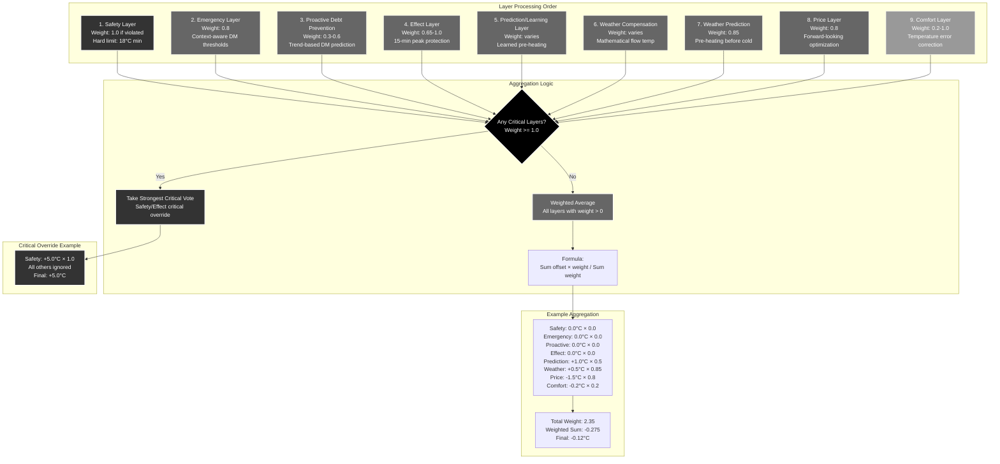

# Layer Priority and Weight System

**Description**: How the 9-layer decision engine aggregates votes with priorities.



## Decision Engine Architecture

### Nine-Layer Hierarchy

The decision engine processes layers in **strict priority order**:

#### Critical Layers (Weight >= 1.0)
These layers can **completely override** all other considerations:

1. **Safety Layer (1.0)**: Absolute temperature limits (18°C minimum indoor)
2. **Effect Layer (1.0)**: Peak protection when critical (already at peak)

#### High-Priority Advisory Layers (Weight 0.8-0.85)
These layers have **strong influence** on decisions:

3. **Emergency Layer (0.8)**: Thermal debt prevention (context-aware DM thresholds)
4. **Price Layer (0.8)**: Forward-looking spot price optimization with adaptive horizon
5. **Weather Prediction (0.85)**: Weather-based pre-heating before cold periods

#### Medium-Priority Layers (Weight 0.3-0.85)
These layers **contribute based on conditions**:

6. **Effect Layer (0.65-0.85)**: Peak protection when predictive/warning states
7. **Proactive Debt Prevention (0.3-0.6)**: Trend-based future DM prediction
8. **Prediction/Learning**: Learned pre-heating using thermal model
9. **Weather Compensation**: Mathematical flow temperature optimization

#### Reactive Layer (Weight 0.2-1.0)
Provides **responsive temperature correction**:

10. **Comfort Layer (0.2-1.0)**: Dynamic weight based on temperature error severity

### Aggregation Algorithm

#### Critical Layer Override
```python
def _aggregate_layers(self, layers: list[LayerDecision]) -> float:
    # Separate critical layers (weight = 1.0)
    critical_layers = [layer for layer in layers if layer.weight >= 1.0]
    
    if critical_layers:
        # Take the strongest critical vote
        max_offset = max(layer.offset for layer in critical_layers)
        min_offset = min(layer.offset for layer in critical_layers)
        
        # Choose more conservative (safety-oriented) option
        if abs(max_offset) > abs(min_offset):
            return max_offset
        else:
            return min_offset
```

#### Weighted Average Calculation
```python
    # Otherwise, weighted average of all layers
    total_weight = sum(layer.weight for layer in layers)
    if total_weight == 0:
        return 0.0
    
    weighted_sum = sum(layer.offset * layer.weight for layer in layers)
    return weighted_sum / total_weight
```

### Layer Weight Rationale

#### Critical Layers (1.0)
- **Safety**: Human comfort and system protection (18°C hard minimum)
- **Effect (Critical)**: Financial protection when already at peak

**Design Philosophy**: These concerns are **non-negotiable** and override all cost optimization.

#### High-Priority Layers (0.8-0.85)
- **Weather Prediction (0.85)**: Pre-heating is time-sensitive, must act before cold arrives
- **Emergency (0.8)**: Heat pump damage prevention, balanced with cost optimization
- **Price (0.8)**: Strong cost optimization with forward-looking and thermal storage awareness

**Balances**: Critical operational needs with intelligent cost management

#### Effect Layer Dynamic Weighting
- **Critical (1.0)**: Already at peak - immediate action required
- **Predictive (0.85)**: Will approach peak soon (<1kW margin) - act now
- **Warning Rising (0.75)**: Close to peak + demand rising - caution
- **Warning Stable (0.65)**: Close to peak + demand stable - monitor

#### Comfort Layer Dynamic Weighting
- **Critical (1.0)**: >2°C beyond tolerance - emergency correction
- **Severe (0.9)**: 1-2°C beyond tolerance - strong correction
- **High (0.7)**: 0-1°C beyond tolerance - moderate correction  
- **Mild (0.2)**: Within tolerance - gentle steering

**Purpose**: Graduated response matching severity while allowing optimization when comfortable

### Example Scenarios

#### Normal Operation (No Critical Layers)
```
Safety:     0.0°C × 0.0 = 0.00    (within limits)
Emergency:  0.0°C × 0.0 = 0.00    (DM normal)
Proactive:  0.0°C × 0.0 = 0.00    (trend normal)
Effect:     0.0°C × 0.0 = 0.00    (peak safe)
Prediction: +1.0°C × 0.5 = 0.50   (learned pre-heat)
Weather:    +0.5°C × 0.85 = 0.43  (mild pre-heat)  
Price:      -1.5°C × 0.8 = -1.20  (expensive period)
Comfort:    -0.2°C × 0.2 = -0.04  (slightly warm)

Total Weight: 2.35
Weighted Sum: 0.50 + 0.43 - 1.20 - 0.04 = -0.31
Final Decision: -0.31 / 2.35 = -0.13°C
```

**Result**: Slight reduction, **price optimization wins** over pre-heating signals during expensive period.

#### Critical Safety Override
```
Safety:     +5.0°C × 1.0 = 5.00   (too cold: 17°C indoor)
Emergency:  +0.5°C × 0.5 = 0.25   (minor thermal debt)  
Effect:     0.0°C × 0.0 = 0.00    (peak safe)
[All other layers ignored due to critical override]

Final Decision: +5.0°C
```

**Result**: **Maximum heating** regardless of cost or other factors.

#### Critical Layer Override
```
Safety:     +5.0°C × 1.0 = 5.00   (too cold: 17°C indoor)
Emergency:  +2.0°C × 0.8 = 1.60   (moderate thermal debt)
Effect:     -1.0°C × 0.65 = -0.65 (warning state)
[All other layers ignored due to critical safety override]

Critical Override:
- Safety has weight 1.0 (critical)
- Takes complete precedence

Final Decision: +5.0°C
```

**Result**: **Safety override** - maximum heating regardless of cost or peak risk.

### Conflict Resolution Strategy

#### Critical Layer Conflicts
When multiple critical layers disagree:

1. **Take the stronger absolute vote**: `max(abs(offset))`
2. **Rationale**: More urgent situations take precedence
3. **Safety philosophy**: When in doubt, protect the heat pump

#### Advisory Layer Balance
Non-critical layers achieve **natural balance** through weighted averaging:
- Competing influences moderate each other
- User tolerance settings scale optimization aggressiveness  
- No single layer dominates unless situation is truly critical

### Dynamic Weight Adjustment

#### Comfort Layer Scaling
```python
def _comfort_layer(self, nibe_state) -> LayerDecision:
    temp_error = nibe_state.indoor_temp - self.target_temp
    tolerance = self.tolerance_range  # ±0.4-4.0°C based on user setting
    
    if abs(temp_error) < 0.2:
        weight = 0.0  # Very close to target
    elif abs(temp_error) < tolerance:
        weight = 0.2  # Within tolerance, gentle steering
    else:
        weight = 0.5  # Outside tolerance, stronger correction
```

#### Emergency Layer Scaling  
```python
def _emergency_layer(self, nibe_state) -> LayerDecision:
    degree_minutes = nibe_state.degree_minutes
    
    if degree_minutes <= -1500:
        weight = 1.0  # Absolute maximum
    elif margin_to_limit < 300:
        weight = 1.0  # Critical range
    elif beyond_expected_warning:
        weight = 0.8  # Warning level
    elif approaching_expected:
        weight = 0.5  # Caution level
    else:
        weight = 0.0  # Normal operation
```

This **dynamic weighting system** ensures the decision engine responds appropriately to the severity of each situation while maintaining balanced optimization during normal operation.