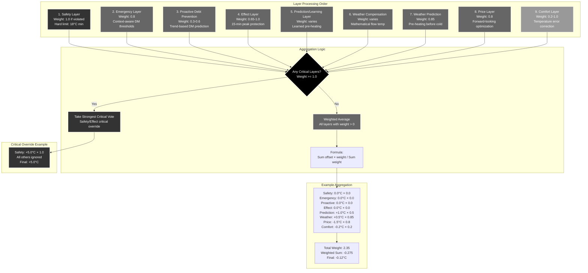

# Layer Priority and Weight System

**Description**: How the 9-layer decision engine aggregates votes with priorities.


```mermaid
flowchart TD
    subgraph "Layer Processing Order"
        A[1. Safety Layer<br/>Weight: 1.0 if violated<br/>Hard limit: 18°C min]
        B[2. Emergency Layer<br/>Weight: 0.8<br/>Context-aware DM thresholds]
        C[3. Proactive Debt Prevention<br/>Weight: 0.3-0.6<br/>Trend-based DM prediction]
        D[4. Effect Layer<br/>Weight: 0.65-1.0<br/>15-min peak protection]
        E[5. Prediction/Learning Layer<br/>Weight: varies<br/>Learned pre-heating]
        F[6. Weather Compensation<br/>Weight: varies<br/>Mathematical flow temp]
        G[7. Weather Prediction<br/>Weight: 0.85<br/>Pre-heating before cold]
        H[8. Price Layer<br/>Weight: 0.8<br/>Forward-looking optimization]
        I[9. Comfort Layer<br/>Weight: 0.2-1.0<br/>Temperature error correction]
    end

    subgraph "Aggregation Logic"
        J{Any Critical Layers?<br/>Weight >= 1.0}
        K[Take Strongest Critical Vote<br/>Safety/Effect critical override]
        L[Weighted Average<br/>All layers with weight > 0]
        M[Formula:<br/>Sum offset × weight / Sum weight]
    end

    subgraph "Example Aggregation"
        N[Safety: 0.0°C × 0.0<br/>Emergency: 0.0°C × 0.0<br/>Proactive: 0.0°C × 0.0<br/>Effect: 0.0°C × 0.0<br/>Prediction: +1.0°C × 0.5<br/>Weather: +0.5°C × 0.85<br/>Price: -1.5°C × 0.8<br/>Comfort: -0.2°C × 0.2]
        O[Total Weight: 2.35<br/>Weighted Sum: -0.275<br/>Final: -0.12°C]
    end

    subgraph "Critical Override Example"
        P[Safety: +5.0°C × 1.0<br/>All others ignored<br/>Final: +5.0°C]
    end

    %% Flow
    A --> J
    B --> J
    C --> J
    D --> J
    E --> J
    F --> J
    G --> J
    H --> J
    I --> J
    
    J -->|Yes| K
    J -->|No| L
    L --> M
    
    M --> N
    N --> O
    
    K --> P

    %% Styling
    style A fill:#333,stroke:#fff,stroke-width:2px,color:#fff
    style B fill:#666,stroke:#fff,stroke-width:1px,color:#fff
    style C fill:#666,stroke:#fff,stroke-width:1px,color:#fff
    style D fill:#666,stroke:#fff,stroke-width:1px,color:#fff
    style E fill:#666,stroke:#fff,stroke-width:1px,color:#fff
    style F fill:#666,stroke:#fff,stroke-width:1px,color:#fff
    style G fill:#666,stroke:#fff,stroke-width:1px,color:#fff
    style H fill:#666,stroke:#fff,stroke-width:1px,color:#fff
    style I fill:#999,stroke:#fff,stroke-width:1px,color:#fff
    
    style J fill:#000,stroke:#fff,stroke-width:2px,color:#fff
    style K fill:#333,stroke:#fff,stroke-width:2px,color:#fff
    style L fill:#666,stroke:#fff,stroke-width:2px,color:#fff
    style P fill:#333,stroke:#fff,stroke-width:2px,color:#fff
```

## Decision Engine Architecture

### Nine-Layer Hierarchy

The decision engine processes layers in **strict priority order**:

#### Critical Layers (Weight >= 1.0)
These layers can **completely override** all other considerations:

1. **Safety Layer (1.0)**: Absolute temperature limits (18°C minimum indoor)
2. **Effect Layer (1.0)**: Peak protection when critical (already at peak)

#### High-Priority Advisory Layers (Weight 0.8-0.85)
These layers have **strong influence** on decisions:

3. **Emergency Layer (0.8)**: Thermal debt prevention (context-aware DM thresholds)
4. **Price Layer (0.8)**: Forward-looking spot price optimization with adaptive horizon
5. **Weather Prediction (0.85)**: Weather-based pre-heating before cold periods

#### Medium-Priority Layers (Weight 0.3-0.85)
These layers **contribute based on conditions**:

6. **Effect Layer (0.65-0.85)**: Peak protection when predictive/warning states
7. **Proactive Debt Prevention (0.3-0.6)**: Trend-based future DM prediction
8. **Prediction/Learning**: Learned pre-heating using thermal model
9. **Weather Compensation**: Mathematical flow temperature optimization

#### Reactive Layer (Weight 0.2-1.0)
Provides **responsive temperature correction**:

10. **Comfort Layer (0.2-1.0)**: Dynamic weight based on temperature error severity

### Aggregation Algorithm

> ⚠️ **This section previously reproduced a version of `_aggregate_layers` that no longer
> exists, and whose behaviour was a bug.** It showed a single "critical layer override" whose
> tie-break was `if abs(max_offset) > abs(min_offset)`. With the emergency layer asking for
> **+10.0** at DM −1520 and a cost layer at critical weight asking for **−10.0**, `abs(+10) >
> abs(−10)` is **False** — so it returned **−10.0: maximum cooling, in a thermal-debt
> emergency.** The stated philosophy ("take the stronger absolute vote… when in doubt, protect
> the heat pump") *was* the defect. Do not restore it. What follows is the algorithm that runs.

`_aggregate_layers` is an ordered cascade, not a vote. The invariant it exists to enforce:

> **A cost layer (spot price, effect tariff) must NEVER reduce heating while the thermal-debt
> layer is actively recovering.**

```python
# 1. Safety layer - indoor below MIN_TEMP_LIMIT. Absolute; nothing else is consulted.
if safety_layer and safety_layer.weight >= LAYER_WEIGHT_SAFETY:
    return clamp(safety_layer.offset)

# 2. EMERGENCY tier - DM past DM_THRESHOLD_AUX_LIMIT. Absolute.
#    Suppressing recovery to protect the effect tariff does not avoid the peak: it
#    guarantees a bigger one from the immersion heater, while the debt deepens.
if emergency_layer and emergency_layer.tier == DM_TIER_EMERGENCY:
    return clamp(emergency_layer.offset)

# 3. Recovery tiers T1/T2/T3 - debt past the climate-aware warning threshold.
#    A critical cost layer may MODERATE the response, never reverse it.
if emergency_layer and emergency_layer.tier in DM_RECOVERY_TIERS:
    floor = DM_CRITICAL_PEAK_AWARE_OFFSETS[emergency_layer.tier]   # by TIER, not by weight
    if has_critical_cost_layer(layers):
        return clamp(floor)                       # peak-aware compromise
    return clamp(max(weighted_average(layers), floor))   # never below the tier's floor

# 4. Any remaining critical layers, with no recovery in progress.
critical = [l for l in layers if l.weight >= LAYER_WEIGHT_SAFETY]
if critical:
    hi, lo = max(l.offset for l in critical), min(l.offset for l in critical)
    return clamp(hi if abs(hi) >= abs(lo) else lo)   # `>=`, so an exact tie HEATS

# 5. Everything else: weighted average.
return clamp(weighted_average(layers))
```

Two details that look like nits and are not:

- **Tiers are read from `EmergencyLayerDecision.tier`, never inferred from a weight or an offset
  magnitude.** Damping mutates the offset and a weight is a tuning knob, so inferring from either
  lets a damped or retuned tier fall through into the cost-layer override path.
- **The tie-break at step 4 is `>=`, not `>`.** `SAFETY_EMERGENCY_OFFSET` (+10) and
  `PRICE_OFFSET_PEAK` (−10) tie by construction, and `>` returned the negative vote.

### Layer Weight Rationale

#### Critical Layers (1.0)
- **Safety**: Human comfort and system protection (18°C hard minimum)
- **Effect (Critical)**: Financial protection when already at peak

**Design Philosophy**: These concerns are **non-negotiable** and override all cost optimization.

#### High-Priority Layers (0.8-0.85)
- **Weather Prediction (0.85)**: Pre-heating is time-sensitive, must act before cold arrives
- **Emergency (0.8)**: Heat pump damage prevention, balanced with cost optimization
- **Price (0.8)**: Strong cost optimization with forward-looking and thermal storage awareness

**Balances**: Critical operational needs with intelligent cost management

#### Effect Layer Dynamic Weighting
- **Critical (1.0)**: Already at peak - immediate action required
- **Predictive (0.85)**: Will approach peak soon (<1kW margin) - act now
- **Warning Rising (0.75)**: Close to peak + demand rising - caution
- **Warning Stable (0.65)**: Close to peak + demand stable - monitor

#### Comfort Layer Dynamic Weighting
- **Critical (1.0)**: >2°C beyond tolerance - emergency correction
- **Severe (0.9)**: 1-2°C beyond tolerance - strong correction
- **High (0.7)**: 0-1°C beyond tolerance - moderate correction  
- **Mild (0.2)**: Within tolerance - gentle steering

**Purpose**: Graduated response matching severity while allowing optimization when comfortable

### Example Scenarios

#### Normal Operation (No Critical Layers)
```
Safety:     0.0°C × 0.0 = 0.00    (within limits)
Emergency:  0.0°C × 0.0 = 0.00    (DM normal)
Proactive:  0.0°C × 0.0 = 0.00    (trend normal)
Effect:     0.0°C × 0.0 = 0.00    (peak safe)
Prediction: +1.0°C × 0.5 = 0.50   (learned pre-heat)
Weather:    +0.5°C × 0.85 = 0.43  (mild pre-heat)  
Price:      -1.5°C × 0.8 = -1.20  (expensive period)
Comfort:    -0.2°C × 0.2 = -0.04  (slightly warm)

Total Weight: 2.35
Weighted Sum: 0.50 + 0.43 - 1.20 - 0.04 = -0.31
Final Decision: -0.31 / 2.35 = -0.13°C
```

**Result**: Slight reduction, **price optimization wins** over pre-heating signals during expensive period.

#### Critical Safety Override
```
Safety:     +5.0°C × 1.0 = 5.00   (too cold: 17°C indoor)
Emergency:  +0.5°C × 0.5 = 0.25   (minor thermal debt)  
Effect:     0.0°C × 0.0 = 0.00    (peak safe)
[All other layers ignored due to critical override]

Final Decision: +5.0°C
```

**Result**: **Maximum heating** regardless of cost or other factors.

#### Critical Layer Override
```
Safety:     +5.0°C  weight 1.0   (too cold: 17°C indoor)
Emergency:  +2.0°C  weight 0.8   (moderate thermal debt)
Effect:     -1.0°C  weight 0.65  (warning state)

Step 1 of the cascade matches: the safety layer is at LAYER_WEIGHT_SAFETY.
It RETURNS. No weighted average is computed and no other layer is consulted.

Final Decision: +5.0°C
```

**Result**: **Safety override** - maximum heating regardless of cost or peak risk.

### Conflict Resolution Strategy

#### Critical Layer Conflicts
The cascade decides by **priority**, not by magnitude. Safety, then the EMERGENCY tier, then the
recovery tiers, then any other critical layer, then the weighted average — the first one that
matches returns.

Only step 4 compares two critical layers directly, and it prefers the **heating** vote on an
exact tie (`abs(hi) >= abs(lo)`). "Take the stronger absolute vote" is **not** the rule, and was
never a safe one: the strongest absolute vote in a thermal-debt emergency can be a cost layer
demanding −10.0.

⚠️ **Both cost layers promote themselves to critical weight.** The price layer (in PEAK quarters)
and the effect layer (at the monthly peak) reach `LAYER_WEIGHT_SAFETY`. That is why steps 2 and 3
exist at all: without them, a critical cost layer would sit in step 4 alongside the emergency
layer and could win. An earlier version of this document asserted that only Safety and Effect ever
reach 1.0 — it does not hold, and reasoning from it produced real defects.

#### Advisory Layer Balance
Non-critical layers achieve **natural balance** through weighted averaging:
- Competing influences moderate each other
- User tolerance settings scale optimization aggressiveness  
- No single layer dominates unless situation is truly critical

### Dynamic Weight Adjustment

#### Comfort Layer Scaling
```python
def _comfort_layer(self, nibe_state) -> LayerDecision:
    temp_error = nibe_state.indoor_temp - self.target_temp
    tolerance = self.tolerance_range  # ±0.4-4.0°C based on user setting
    
    if abs(temp_error) < 0.2:
        weight = 0.0  # Very close to target
    elif abs(temp_error) < tolerance:
        weight = 0.2  # Within tolerance, gentle steering
    else:
        weight = 0.5  # Outside tolerance, stronger correction
```

#### Emergency Layer Scaling  
```python
def _emergency_layer(self, nibe_state) -> LayerDecision:
    degree_minutes = nibe_state.degree_minutes
    
    if degree_minutes <= -1500:
        weight = 1.0  # Absolute maximum
    elif margin_to_limit < 300:
        weight = 1.0  # Critical range
    elif beyond_expected_warning:
        weight = 0.8  # Warning level
    elif approaching_expected:
        weight = 0.5  # Caution level
    else:
        weight = 0.0  # Normal operation
```

This **dynamic weighting system** ensures the decision engine responds appropriately to the severity of each situation while maintaining balanced optimization during normal operation.