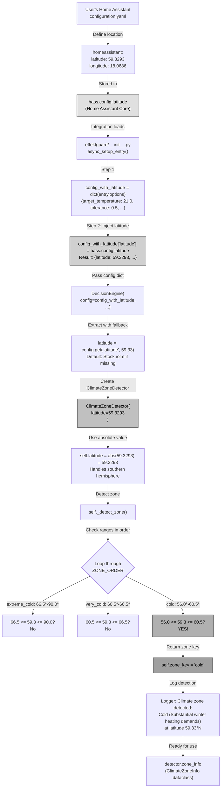
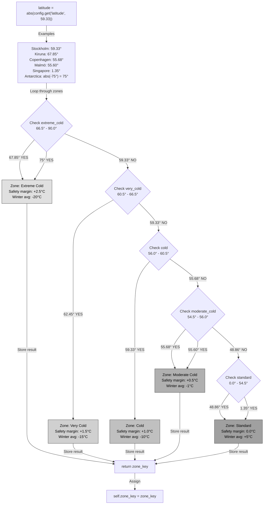
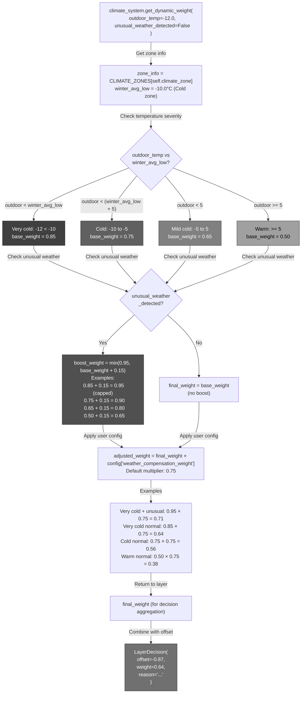
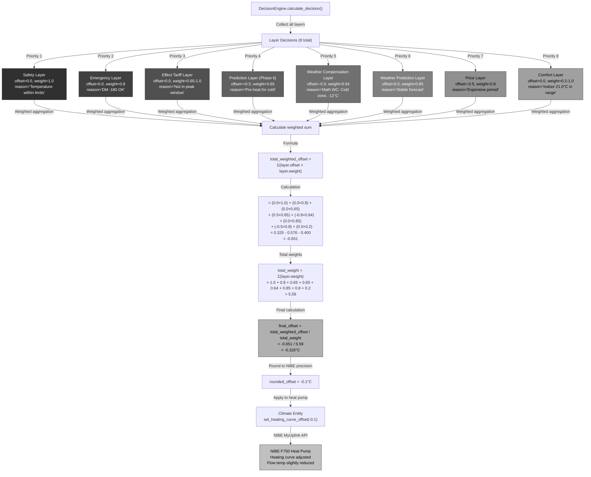

# Adaptive Climate Zone System Architecture

## Overview

Universal climate-based safety margin system that replaces Swedish-specific hardcoding with latitude-based automatic climate detection. Combines proven mathematical formulas with adaptive learning for global applicability.

# Adaptive Climate Zone System Architecture

## Overview

Universal climate-based safety margin system that replaces Swedish-specific hardcoding with latitude-based automatic climate detection. Combines proven mathematical formulas with adaptive learning for global applicability.

---

## Diagram 1: Latitude Source & Initialization Flow

**Shows exactly where latitude comes from and how it flows through the system.**



---

## Diagram 2: Climate Zone Detection Logic

**Shows the exact decision tree for zone detection with all edge cases.**



---

## Diagram 3: Runtime Safety Margin Calculation

**Shows exactly how safety margins are calculated during each optimization cycle.**

```mermaid
flowchart TD
    A["Coordinator Update (every 5 min)"] -->|Trigger| B["DecisionEngine.calculate_decision()"]
    
    B -->|Call layer 5| C["_weather_compensation_layer(nibe_state, weather_data)"]
    
    C -->|Check config| D{self.enable_weather<br/>_compensation?}
    D -->|False| E1["Return LayerDecision:<br/>offset=0.0, weight=0.0<br/>reason='disabled'"]
    D -->|True| E2["Continue"]
    
    E2 -->|Extract data| F["outdoor_temp = nibe_state.outdoor_temp<br/>current_flow = nibe_state.flow_temp<br/>Example: -12°C, 38°C"]
    
    F -->|Calculate optimal| G["weather_comp.calculate_optimal_flow_temp()<br/>Uses André Kühne formula"]
    G -->|Result| H["flow_calc.flow_temp = 35.5°C<br/>(mathematical optimum)"]
    
    H -->|Check weather learner| I{self.weather_learner<br/>exists?}
    I -->|Yes| J["weather_learner.detect_unusual_weather(forecast)"]
    I -->|No| K["unusual_weather = False<br/>unusual_severity = 0.0"]
    
    J -->|Check result| L{is_unusual?}
    L -->|Yes| M["unusual_weather = True<br/>severity = 1.0 if 'extreme' else 0.5"]
    L -->|No| K
    
    K & M -->|Pass to climate system| N["climate_system.get_safety_margin(<br/>  outdoor_temp=-12.0,<br/>  unusual_weather_detected=False,<br/>  unusual_severity=0.0<br/>)"]
    
    N -->|Get zone info| O["zone_info = CLIMATE_ZONES[self.climate_zone]<br/>Example Cold zone:<br/>  base: 1.0°C<br/>  winter_avg_low: -10.0°C"]
    
    O -->|Calculate component 1| P["base_margin = zone_info['safety_margin_base']<br/>= 1.0°C"]
    
    O -->|Calculate component 2| Q{outdoor_temp < winter_avg_low?}
    Q -->|Yes: -12 < -10| R["temp_margin = (winter_avg_low - outdoor) × 0.1<br/>= (-10 - (-12)) × 0.1 = 0.2°C"]
    Q -->|No: outdoor >= winter_avg| S["temp_margin = 0.0°C"]
    
    R & S -->|Calculate component 3| T{unusual_weather_detected?}
    T -->|Yes| U["learning_margin = 0.5 + (unusual_severity × 1.0)<br/>Examples:<br/>  severity=0.5 → 1.0°C<br/>  severity=1.0 → 1.5°C"]
    T -->|No| V["learning_margin = 0.0°C"]
    
    U & V -->|Sum all components| W["total_margin = base + temp + learning<br/>Example: 1.0 + 0.2 + 0.0 = 1.2°C"]
    
    W -->|Return| X["safety_margin = 1.2°C"]
    
    X -->|Apply to optimal| Y["adjusted_flow_temp = flow_calc.flow_temp + safety_margin<br/>= 35.5 + 1.2 = 36.7°C"]
    
    Y -->|Calculate offset| Z["offset = (adjusted_flow - current_flow) / 1.5<br/>= (36.7 - 38.0) / 1.5 = -0.87°C<br/>(NIBE curve sensitivity: 1.5°C per offset)"]
    
    style P fill:#e0e0e0,stroke:#333,color:#000
    style R fill:#d0d0d0,stroke:#333,color:#000
    style U fill:#c0c0c0,stroke:#333,color:#000
    style W fill:#b0b0b0,stroke:#333,color:#000
    style Z fill:#a0a0a0,stroke:#333,color:#fff
```



---

## Diagram 4: Dynamic Weight Calculation

**Shows how layer weight adjusts based on temperature severity and unusual weather.**



---

## Diagram 5: Decision Aggregation (All 8 Layers)

**Shows how weather compensation layer vote combines with other layers.**



---

## Data Flow Detail

### 1. Latitude Source
```python
# Home Assistant Core Configuration (config/configuration.yaml)
homeassistant:
  name: Home
  latitude: 59.3293    # Stockholm, Sweden
  longitude: 18.0686
  elevation: 28
  unit_system: metric
  time_zone: Europe/Stockholm

# This becomes: hass.config.latitude = 59.3293
```

### 2. Integration Initialization (`__init__.py`)
```python
# Step 1: Copy user options from config flow
config_with_latitude = dict(entry.options)
# entry.options = {
#     "target_temperature": 21.0,
#     "tolerance": 0.5,
#     "enable_price_optimization": True,
#     ...
# }

# Step 2: Inject latitude from Home Assistant global config
config_with_latitude["latitude"] = hass.config.latitude  # 59.3293

# Step 3: Pass to DecisionEngine
decision_engine = DecisionEngine(
    price_analyzer=price_analyzer,
    effect_manager=effect_manager,
    thermal_model=thermal_model,
    config=config_with_latitude,  # Now includes latitude!
    ...
)
```

### 3. DecisionEngine Initialization
```python
# Extract latitude with default fallback
latitude = config.get("latitude", 59.33)  # Default: Stockholm if missing

# Create climate zone detector (from climate_zones.py)
self.climate_zone_detector = ClimateZoneDetector(latitude=latitude)

# Access zone info for calculations
zone_info = self.climate_zone_detector.zone_info
# zone_info.dm_normal_min = -450
# zone_info.dm_normal_max = -700
# zone_info.dm_warning_threshold = -700
# zone_info.safety_margin_base = 1.0
```

### 4. ClimateZoneDetector Initialization
```python
# From climate_zones.py
detector = ClimateZoneDetector(latitude=59.33)

# Detection logic:
# 59.33° falls in range (56.0°, 60.5°) → "cold" zone
# Zone info:
#   name: "Cold"
#   description: "Substantial winter heating demands"
#   winter_avg_low: -10.0°C
#   safety_margin_base: 1.0°C
#   dm_normal_range: (-450, -700)
#   examples: ["Stockholm (SWE)", "Oslo (NOR)", "Göteborg (SWE)", "Helsinki (FIN)"]

_LOGGER.info(
    "Climate zone detected: Cold (Substantial winter heating demands) at latitude 59.33°N - "
    "Winter avg: -10.0°C, DM normal range: -450 to -700"
)
```

### 5. Runtime: Weather Compensation Layer
```python
# Called every 5 minutes during coordinator update
def _weather_compensation_layer(self, nibe_state, weather_data):
    # Check if enabled
    if not self.enable_weather_compensation:
        return LayerDecision(offset=0.0, weight=0.0, reason="disabled")
    
    # Get current conditions
    outdoor_temp = -12.0  # Example: Stockholm winter
    current_flow = 38.0   # Current NIBE flow temperature
    
    # Calculate optimal flow using math formulas
    flow_calc = self.weather_comp.calculate_optimal_flow_temp(
        indoor_setpoint=21.0,
        outdoor_temp=-12.0,
        prefer_method="auto"
    )
    # Result: flow_calc.flow_temp = 35.5°C (from Kühne formula)
    
    # Check for unusual weather
    unusual_weather = False
    unusual_severity = 0.0
    if self.weather_learner:
        unusual = self.weather_learner.detect_unusual_weather(...)
        if unusual.is_unusual:
            unusual_weather = True
            unusual_severity = 1.0 if unusual.severity == "extreme" else 0.5
    
    # Get adaptive safety margin
    safety_margin = self.climate_system.get_safety_margin(
        outdoor_temp=-12.0,
        unusual_weather_detected=unusual_weather,  # False in this example
        unusual_severity=unusual_severity,          # 0.0
    )
    # Calculation:
    #   base_margin = 1.0°C (Cold zone)
    #   temp_margin = (-10.0 - (-12.0)) × 0.1 = 0.2°C (colder than avg)
    #   learning_margin = 0.0 (no unusual weather)
    #   total = 1.0 + 0.2 + 0.0 = 1.2°C
    
    # Apply safety margin
    adjusted_flow_temp = 35.5 + 1.2 = 36.7°C
    
    # Calculate required offset
    # NIBE sensitivity: 1.5°C flow change per 1°C offset
    required_offset = (36.7 - 38.0) / 1.5 = -0.87°C
    
    # Get dynamic weight
    dynamic_weight = self.climate_system.get_dynamic_weight(
        outdoor_temp=-12.0,
        unusual_weather_detected=False
    )
    # Logic:
    #   outdoor (-12°C) < winter_avg_low (-10°C) → very cold → 0.85
    
    # Apply user-configured weight multiplier
    final_weight = 0.85 × 0.75 = 0.6375
    
    return LayerDecision(
        offset=-0.87,
        weight=0.6375,
        reason="Math WC: kuehne; Zone: Cold Continental; Optimal: 35.5°C; "
               "Safety: +1.2°C; Adjusted: 36.7°C; Current: 38.0°C → offset: -0.9°C; "
               "Weight: 0.64"
    )
```

### 6. Decision Aggregation Example
```python
# All layers vote (simplified):
layers = [
    LayerDecision(offset=0.0, weight=1.0, reason="Safety: OK"),          # Safety
    LayerDecision(offset=0.0, weight=0.8, reason="Emergency: OK"),       # Emergency
    LayerDecision(offset=0.0, weight=0.65, reason="Effect: Not peak"),   # Effect
    LayerDecision(offset=0.5, weight=0.65, reason="Prediction: pre-heat"),  # Prediction
    LayerDecision(offset=-0.9, weight=0.64, reason="Weather comp: -12°C"),  # Weather Comp
    LayerDecision(offset=0.0, weight=0.85, reason="Weather: Stable"),    # Weather
    LayerDecision(offset=-0.5, weight=0.8, reason="Price: Expensive"),   # Price
    LayerDecision(offset=0.0, weight=0.2, reason="Comfort: In range"),   # Comfort
]

# Weighted aggregation:
total_weighted_offset = (
    0.0×1.0 + 0.0×0.8 + 0.0×0.65 + 0.5×0.65 + (-0.9)×0.64 + 
    0.0×0.85 + (-0.5)×0.8 + 0.0×0.2
) = 0.325 - 0.576 - 0.400 = -0.651

total_weight = 1.0 + 0.8 + 0.65 + 0.65 + 0.64 + 0.85 + 0.8 + 0.2 = 5.59

final_offset = -0.651 / 5.59 = -0.116°C

# Apply to NIBE heating curve
climate_entity.set_offset(-0.1)  # Rounded to 0.1°C precision
```

## Climate Zone Detection Logic

```python
def _detect_zone(self) -> str:
    """Detect climate zone based on latitude."""
    # Use absolute for hemisphere independence
    latitude = self.latitude  # Already abs() in __init__
    
    # Check from coldest to mildest (defined in ZONE_ORDER)
    for zone_key in ["extreme_cold", "very_cold", "cold", "moderate_cold", "standard"]:
        zone_data = HEATING_CLIMATE_ZONES[zone_key]
        lat_min, lat_max = zone_data["latitude_range"]
        
        if lat_min <= latitude <= lat_max:
            return zone_key
    
    # Fallback for edge cases
    return "standard"
```

## Real-World Examples

### Example 1: Kiruna, Sweden (67.85°N, -35°C)
```
Initialization:
  hass.config.latitude = 67.85
  → Detected zone: extreme_cold
  → winter_avg_low: -20.0°C
  → safety_margin_base: 2.5°C
  → dm_normal_range: (-800, -1200)

Runtime (outdoor = -35°C, no unusual weather):
  1. Kühne formula: 42.0°C optimal flow
  2. Safety margin calculation:
     - base: 2.5°C (extreme_cold)
     - temp: (-20 - (-35)) × 0.1 = 1.5°C (colder than avg)
     - unusual: 0.0°C (no unusual weather)
     - total: 4.0°C
  3. Adjusted flow: 42.0 + 4.0 = 46.0°C
  4. Dynamic weight: 0.85 (very cold)
  5. Final weight: 0.85 × 0.75 = 0.6375

Result: Aggressive heating to prevent thermal debt in extreme cold
```

### Example 2: Stockholm, Sweden (59.33°N, -10°C)
```
Initialization:
  hass.config.latitude = 59.33
  → Detected zone: cold
  → winter_avg_low: -10.0°C
  → safety_margin_base: 1.0°C
  → dm_normal_range: (-450, -700)

Runtime (outdoor = -10°C, no unusual weather):
  1. Kühne formula: 35.5°C optimal flow
  2. Safety margin calculation:
     - base: 1.0°C (cold)
     - temp: 0.0°C (at winter average)
     - unusual: 0.0°C (no unusual weather)
     - total: 1.0°C
  3. Adjusted flow: 35.5 + 1.0 = 36.5°C
  4. Dynamic weight: 0.75 (cold)
  5. Final weight: 0.75 × 0.75 = 0.5625

Result: Balanced approach for typical Swedish winter
```

### Example 3: Copenhagen, Denmark (55.68°N, 2°C)
```
Initialization:
  hass.config.latitude = 55.68
  → Detected zone: moderate_cold
  → winter_avg_low: -1.0°C
  → safety_margin_base: 0.5°C
  → dm_normal_range: (-300, -500)

Runtime (outdoor = 2°C, no unusual weather):
  1. Kühne formula: 28.0°C optimal flow
  2. Safety margin calculation:
     - base: 0.5°C (moderate_cold)
     - temp: 0.0°C (warmer than winter avg)
     - unusual: 0.0°C (no unusual weather)
     - total: 0.5°C
  3. Adjusted flow: 28.0 + 0.5 = 28.5°C
  4. Dynamic weight: 0.75 (cold for Copenhagen)
  5. Final weight: 0.75 × 0.75 = 0.5625

Result: Moderate heating for Øresund region winter conditions
```

### Example 4: Paris, France (48.86°N, 8°C)
```
Initialization:
  hass.config.latitude = 48.86
  → Detected zone: standard
  → winter_avg_low: 5.0°C
  → safety_margin_base: 0.0°C
  → dm_normal_range: (-200, -350)

Runtime (outdoor = 8°C, no unusual weather):
  1. Kühne formula: 24.0°C optimal flow
  2. Safety margin calculation:
     - base: 0.0°C (standard)
     - temp: 0.0°C (warmer than winter avg)
     - unusual: 0.0°C (no unusual weather)
     - total: 0.0°C
  3. Adjusted flow: 24.0 + 0.0 = 24.0°C (formulas alone!)
  4. Dynamic weight: 0.50 (warm weather)
  5. Final weight: 0.50 × 0.75 = 0.375

Result: Pure mathematical optimization for mild climate
```

## Configuration

### Automatic (No User Input)
- **Latitude**: From Home Assistant global config (`hass.config.latitude`)
- **Climate zone**: Automatically detected from latitude
- **Weather learner**: Automatically used if available (Phase 6)

### User-Configurable (Future - Phase 4 TODO)
- `enable_weather_compensation`: Boolean (default: True)
- `weather_compensation_weight`: 0.0-1.0 (default: 0.75)

### Advanced (Config file / learning)
- `heat_loss_coefficient`: W/°C (learned or user-provided)
- `radiator_rated_output`: Watts (optional for Timbones method)
- `heating_type`: "radiator", "concrete_ufh", "timber" (for UFH adjustments)

## Key Benefits

1. **Zero Configuration**: Uses HA latitude automatically
2. **Global Coverage**: Arctic to Mediterranean with same code
3. **Adaptive**: Combines zones + current temp + unusual weather
4. **Safe**: Progressive margins scale with cold severity
5. **Testable**: Clear inputs/outputs, 26 passing tests
6. **Maintainable**: No country-specific conditionals

## Technical Notes

### Edge Cases & Fallback Behavior

**Tested with 35 comprehensive tests including 9 edge case scenarios.**

#### 1. Equatorial Locations (< 54.5°N)
```python
# Example: Singapore (1.35°N), Paris (48.86°N)
latitude = 48.86
# Result: Falls in "standard" zone (0.0°-54.5°)
# Rationale: Standard zone covers all mild climates globally
```

#### 2. Southern Hemisphere (Negative Latitude)
```python
# Example: Melbourne (-37.81°S), Sydney (-33.87°S)
latitude = -37.81
self.latitude = abs(latitude)  # Convert to 37.81°
# Result: 37.81° → "standard" zone (0.0°-54.5°)
# Rationale: Climate zones symmetric around equator for heating purposes
```

#### 3. Antarctica (Far South)
```python
# Example: McMurdo Station (-77.85°S)
latitude = -77.85
self.latitude = abs(latitude)  # Convert to 77.85°
# Result: 77.85° → "extreme_cold" zone (66.5°-90.0°)
# Rationale: CORRECT! Antarctic bases need same heating as Arctic
```

#### 4. Boundary Cases (Exactly at Zone Transition)
```python
# Arctic Circle (66.5°N) - exactly at boundary
latitude = 66.5
# Logic: if 66.5 <= latitude <= 90.0 → TRUE
# Result: "extreme_cold" zone (inclusive lower bound)

# very_cold/cold boundary (60.5°N)
latitude = 60.5
# very_cold: if 60.5 <= latitude <= 66.5 → TRUE (matches first)
# Result: "very_cold" zone

# cold/moderate_cold boundary (56.0°N)
latitude = 56.0
# cold: if 56.0 <= latitude <= 60.5 → TRUE (matches first)
# Result: "cold" zone

# moderate_cold/standard boundary (54.5°N)
latitude = 54.5
# moderate_cold: if 54.5 <= latitude <= 56.0 → TRUE (matches first)
# Result: "moderate_cold" zone
```

#### 5. Invalid Latitudes (> 90° or very unusual)
```python
# Example: Invalid input > 90° (should never happen)
latitude = 95.0
# Falls through all zone checks
# Result: Defaults to "standard" with warning
# Rationale: Safe fallback, prevents crashes
```

#### 6. Zero Latitude (Equator)
```python
latitude = 0.0
# Falls in standard zone (0.0°-54.5°)
# Result: "standard" zone
```

#### 7. Between Zones (No Gaps)
```python
# Zones are contiguous - all latitudes from 0° to 90° covered:
# extreme_cold:  66.5 - 90.0  (23.5° range)
# very_cold:     60.5 - 66.5  (6.0° range)
# cold:          56.0 - 60.5  (4.5° range)
# moderate_cold: 54.5 - 56.0  (1.5° range)
# standard:      0.0 - 54.5   (54.5° range)
# Total:         0.0 - 90.0   (90° range, no gaps)

# Example: 57.5° (middle of cold zone)
latitude = 57.5
# cold: if 56.0 <= 57.5 <= 60.5 → TRUE
# Result: "cold" zone (clean match, no ambiguity)
```

### Zone Range Overlaps (NONE - Clean Boundaries)

**All zone boundaries are inclusive on lower bound, exclusive on upper (except the topmost).**

```python
"extreme_cold": {
    "latitude_range": (66.5, 90.0),  # Includes 66.5°
},
"very_cold": {
    "latitude_range": (60.5, 66.5),  # 60.5° to 66.4999...°
},
"cold": {
    "latitude_range": (56.0, 60.5),  # 56.0° to 60.4999...°
},
"moderate_cold": {
    "latitude_range": (54.5, 56.0),  # 54.5° to 55.9999...°
},
"standard": {
    "latitude_range": (0.0, 54.5),   # 0° to 54.4999...°
},
```

**Result:** 54.5° → "moderate_cold", 56.0° → "cold" (first match wins in ZONE_ORDER)

### Why Absolute Latitude?
```python
self.latitude = abs(latitude)  # Handle southern hemisphere
```
Melbourne (-37.81°S) → abs(-37.81) = 37.81° → standard zone (same as southern France)

This works because climate zones are symmetric around equator for heat pump purposes. A location at 40°S has similar heating needs to 40°N.

### Why Default to Stockholm (59.33°N)?
Safe fallback if `hass.config.latitude` is somehow missing. Cold zone provides moderate safety margins suitable for most European deployments.

### Why Cap Dynamic Weight at 0.95?
Leave headroom for emergency/safety layers to override. Weather compensation is important but not more critical than preventing thermal debt or protecting from effect tariff peaks.

## Integration Points

- **Input**: `hass.config.latitude` (set during HA initial setup)
- **Output**: Safety margin (°C) and dynamic weight (0.0-1.0) for decision layer
- **Dependencies**: Optional weather_learner (Phase 6) for unusual weather detection
- **Side effects**: None (pure calculation, no state modification)
