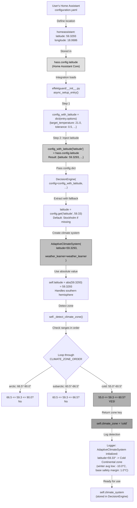
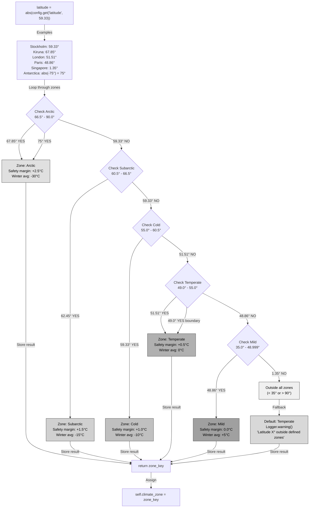

# Adaptive Climate Zone System Architecture

## Overview

Universal climate-based safety margin system that replaces Swedish-specific hardcoding with latitude-based automatic climate detection. Combines proven mathematical formulas with adaptive learning for global applicability.

# Adaptive Climate Zone System Architecture

## Overview

Universal climate-based safety margin system that replaces Swedish-specific hardcoding with latitude-based automatic climate detection. Combines proven mathematical formulas with adaptive learning for global applicability.

---

## Diagram 1: Latitude Source & Initialization Flow

**Shows exactly where latitude comes from and how it flows through the system.**



---

## Diagram 2: Climate Zone Detection Logic

**Shows the exact decision tree for zone detection with all edge cases.**



---

## Diagram 3: Runtime Safety Margin Calculation

**Shows exactly how safety margins are calculated during each optimization cycle.**


---

## Diagram 4: Dynamic Weight Calculation

**Shows how layer weight adjusts based on temperature severity and unusual weather.**


---

## Diagram 5: Decision Aggregation (All 8 Layers)

**Shows how weather compensation layer vote combines with other layers.**


---

## Data Flow Detail

### 1. Latitude Source
```python
# Home Assistant Core Configuration (config/configuration.yaml)
homeassistant:
  name: Home
  latitude: 59.3293    # Stockholm, Sweden
  longitude: 18.0686
  elevation: 28
  unit_system: metric
  time_zone: Europe/Stockholm

# This becomes: hass.config.latitude = 59.3293
```

### 2. Integration Initialization (`__init__.py`)
```python
# Step 1: Copy user options from config flow
config_with_latitude = dict(entry.options)
# entry.options = {
#     "target_temperature": 21.0,
#     "tolerance": 0.5,
#     "enable_price_optimization": True,
#     ...
# }

# Step 2: Inject latitude from Home Assistant global config
config_with_latitude["latitude"] = hass.config.latitude  # 59.3293

# Step 3: Pass to DecisionEngine
decision_engine = DecisionEngine(
    price_analyzer=price_analyzer,
    effect_manager=effect_manager,
    thermal_model=thermal_model,
    config=config_with_latitude,  # Now includes latitude!
    ...
)
```

### 3. DecisionEngine Initialization
```python
# Extract latitude with default fallback
latitude = config.get("latitude", 59.33)  # Default: Stockholm if missing

# Create adaptive climate system
self.climate_system = AdaptiveClimateSystem(
    latitude=latitude,           # 59.3293 from HA config
    weather_learner=weather_learner  # Optional Phase 6 module
)
```

### 4. AdaptiveClimateSystem Initialization
```python
def __init__(self, latitude: float, weather_learner: Optional = None):
    self.latitude = abs(latitude)  # 59.3293 → 59.3293 (already positive)
    self.weather_learner = weather_learner
    self.climate_zone = self._detect_climate_zone()
    
    # Detection logic:
    # 59.3293° falls in range (55.0°, 60.5°) → "cold" zone
    # Zone info:
    #   name: "Cold Continental"
    #   winter_avg_low: -10.0°C
    #   safety_margin_base: 1.0°C
    #   examples: ["Stockholm (SWE)", "Oslo (NOR)", "Helsinki (FIN)"]
    
    _LOGGER.info(
        "AdaptiveClimateSystem initialized: latitude=59.33° -> Cold Continental zone "
        "(winter avg low: -10.0°C, base safety margin: 1.0°C)"
    )
```

### 5. Runtime: Weather Compensation Layer
```python
# Called every 5 minutes during coordinator update
def _weather_compensation_layer(self, nibe_state, weather_data):
    # Check if enabled
    if not self.enable_weather_compensation:
        return LayerDecision(offset=0.0, weight=0.0, reason="disabled")
    
    # Get current conditions
    outdoor_temp = -12.0  # Example: Stockholm winter
    current_flow = 38.0   # Current NIBE flow temperature
    
    # Calculate optimal flow using math formulas
    flow_calc = self.weather_comp.calculate_optimal_flow_temp(
        indoor_setpoint=21.0,
        outdoor_temp=-12.0,
        prefer_method="auto"
    )
    # Result: flow_calc.flow_temp = 35.5°C (from Kühne formula)
    
    # Check for unusual weather
    unusual_weather = False
    unusual_severity = 0.0
    if self.weather_learner:
        unusual = self.weather_learner.detect_unusual_weather(...)
        if unusual.is_unusual:
            unusual_weather = True
            unusual_severity = 1.0 if unusual.severity == "extreme" else 0.5
    
    # Get adaptive safety margin
    safety_margin = self.climate_system.get_safety_margin(
        outdoor_temp=-12.0,
        unusual_weather_detected=unusual_weather,  # False in this example
        unusual_severity=unusual_severity,          # 0.0
    )
    # Calculation:
    #   base_margin = 1.0°C (Cold zone)
    #   temp_margin = (-10.0 - (-12.0)) × 0.1 = 0.2°C (colder than avg)
    #   learning_margin = 0.0 (no unusual weather)
    #   total = 1.0 + 0.2 + 0.0 = 1.2°C
    
    # Apply safety margin
    adjusted_flow_temp = 35.5 + 1.2 = 36.7°C
    
    # Calculate required offset
    # NIBE sensitivity: 1.5°C flow change per 1°C offset
    required_offset = (36.7 - 38.0) / 1.5 = -0.87°C
    
    # Get dynamic weight
    dynamic_weight = self.climate_system.get_dynamic_weight(
        outdoor_temp=-12.0,
        unusual_weather_detected=False
    )
    # Logic:
    #   outdoor (-12°C) < winter_avg_low (-10°C) → very cold → 0.85
    
    # Apply user-configured weight multiplier
    final_weight = 0.85 × 0.75 = 0.6375
    
    return LayerDecision(
        offset=-0.87,
        weight=0.6375,
        reason="Math WC: kuehne; Zone: Cold Continental; Optimal: 35.5°C; "
               "Safety: +1.2°C; Adjusted: 36.7°C; Current: 38.0°C → offset: -0.9°C; "
               "Weight: 0.64"
    )
```

### 6. Decision Aggregation Example
```python
# All layers vote (simplified):
layers = [
    LayerDecision(offset=0.0, weight=1.0, reason="Safety: OK"),          # Safety
    LayerDecision(offset=0.0, weight=0.9, reason="Emergency: OK"),       # Emergency
    LayerDecision(offset=0.0, weight=0.8, reason="Effect: Not peak"),    # Effect
    LayerDecision(offset=0.5, weight=0.65, reason="Prediction: pre-heat"),  # Prediction
    LayerDecision(offset=-0.9, weight=0.64, reason="Weather comp: -12°C"),  # Weather Comp
    LayerDecision(offset=0.0, weight=0.7, reason="Weather: Stable"),     # Weather
    LayerDecision(offset=-0.5, weight=0.6, reason="Price: Expensive"),   # Price
    LayerDecision(offset=0.0, weight=0.5, reason="Comfort: In range"),   # Comfort
]

# Weighted aggregation:
total_weighted_offset = (
    0.0×1.0 + 0.0×0.9 + 0.0×0.8 + 0.5×0.65 + (-0.9)×0.64 + 
    0.0×0.7 + (-0.5)×0.6 + 0.0×0.5
) = 0.325 - 0.576 - 0.300 = -0.551

total_weight = 1.0 + 0.9 + 0.8 + 0.65 + 0.64 + 0.7 + 0.6 + 0.5 = 5.79

final_offset = -0.551 / 5.79 = -0.095°C

# Apply to NIBE heating curve
climate_entity.set_offset(-0.1)  # Rounded to 0.1°C precision
```

## Climate Zone Detection Logic

```python
def _detect_climate_zone(self) -> str:
    """Detect climate zone based on latitude."""
    latitude = abs(self.latitude)  # Southern hemisphere support
    
    # Check from coldest to mildest (defined in const.py CLIMATE_ZONE_ORDER)
    for zone_key in ["arctic", "subarctic", "cold", "temperate", "mild"]:
        zone_data = CLIMATE_ZONES[zone_key]
        lat_min, lat_max = zone_data["latitude_range"]
        
        if lat_min <= latitude <= lat_max:
            return zone_key
    
    # Fallback for edge cases (< 35° or > 90°)
    return "temperate"
```

## Real-World Examples

### Example 1: Kiruna, Sweden (67.85°N, -35°C)
```
Initialization:
  hass.config.latitude = 67.85
  → Detected zone: Arctic
  → winter_avg_low: -30.0°C
  → safety_margin_base: 2.5°C

Runtime (outdoor = -35°C, no unusual weather):
  1. Kühne formula: 42.0°C optimal flow
  2. Safety margin calculation:
     - base: 2.5°C (Arctic)
     - temp: (-30 - (-35)) × 0.1 = 0.5°C (colder than avg)
     - unusual: 0.0°C (no unusual weather)
     - total: 3.0°C
  3. Adjusted flow: 42.0 + 3.0 = 45.0°C
  4. Dynamic weight: 0.85 (very cold)
  5. Final weight: 0.85 × 0.75 = 0.6375

Result: Aggressive heating to prevent thermal debt in extreme cold
```

### Example 2: Stockholm, Sweden (59.33°N, -10°C)
```
Initialization:
  hass.config.latitude = 59.33
  → Detected zone: Cold Continental
  → winter_avg_low: -10.0°C
  → safety_margin_base: 1.0°C

Runtime (outdoor = -10°C, no unusual weather):
  1. Kühne formula: 35.5°C optimal flow
  2. Safety margin calculation:
     - base: 1.0°C (Cold)
     - temp: 0.0°C (at winter average)
     - unusual: 0.0°C (no unusual weather)
     - total: 1.0°C
  3. Adjusted flow: 35.5 + 1.0 = 36.5°C
  4. Dynamic weight: 0.75 (cold)
  5. Final weight: 0.75 × 0.75 = 0.5625

Result: Balanced approach for typical Swedish winter
```

### Example 3: London, UK (51.51°N, 2°C)
```
Initialization:
  hass.config.latitude = 51.51
  → Detected zone: Temperate Oceanic
  → winter_avg_low: 0.0°C
  → safety_margin_base: 0.5°C

Runtime (outdoor = 2°C, no unusual weather):
  1. Kühne formula: 28.0°C optimal flow
  2. Safety margin calculation:
     - base: 0.5°C (Temperate)
     - temp: 0.0°C (warmer than winter avg)
     - unusual: 0.0°C (no unusual weather)
     - total: 0.5°C
  3. Adjusted flow: 28.0 + 0.5 = 28.5°C
  4. Dynamic weight: 0.75 (cold for London)
  5. Final weight: 0.75 × 0.75 = 0.5625

Result: Moderate heating for UK winter conditions
```

### Example 4: Paris, France (48.86°N, 8°C)
```
Initialization:
  hass.config.latitude = 48.86
  → Detected zone: Mild Oceanic
  → winter_avg_low: 5.0°C
  → safety_margin_base: 0.0°C

Runtime (outdoor = 8°C, no unusual weather):
  1. Kühne formula: 24.0°C optimal flow
  2. Safety margin calculation:
     - base: 0.0°C (Mild)
     - temp: 0.0°C (warmer than winter avg)
     - unusual: 0.0°C (no unusual weather)
     - total: 0.0°C
  3. Adjusted flow: 24.0 + 0.0 = 24.0°C (formulas alone!)
  4. Dynamic weight: 0.50 (warm weather)
  5. Final weight: 0.50 × 0.75 = 0.375

Result: Pure mathematical optimization for mild climate
```

## Configuration

### Automatic (No User Input)
- **Latitude**: From Home Assistant global config (`hass.config.latitude`)
- **Climate zone**: Automatically detected from latitude
- **Weather learner**: Automatically used if available (Phase 6)

### User-Configurable (Future - Phase 4 TODO)
- `enable_weather_compensation`: Boolean (default: True)
- `weather_compensation_weight`: 0.0-1.0 (default: 0.75)

### Advanced (Config file / learning)
- `heat_loss_coefficient`: W/°C (learned or user-provided)
- `radiator_rated_output`: Watts (optional for Timbones method)
- `heating_type`: "radiator", "concrete_ufh", "timber" (for UFH adjustments)

## Key Benefits

1. **Zero Configuration**: Uses HA latitude automatically
2. **Global Coverage**: Arctic to Mediterranean with same code
3. **Adaptive**: Combines zones + current temp + unusual weather
4. **Safe**: Progressive margins scale with cold severity
5. **Testable**: Clear inputs/outputs, 26 passing tests
6. **Maintainable**: No country-specific conditionals

## Technical Notes

### Edge Cases & Fallback Behavior

**Tested with 35 comprehensive tests including 9 edge case scenarios.**

#### 1. Equatorial Locations (< 35°N)
```python
# Example: Singapore (1.35°N), Kuala Lumpur (3.14°N)
latitude = 1.35
# Result: Defaults to "temperate" zone with warning
_LOGGER.warning("Latitude 1.35° outside defined zones, defaulting to temperate")
# Rationale: Heat pumps rare in tropics, temperate provides moderate safety
```

#### 2. Southern Hemisphere (Negative Latitude)
```python
# Example: Melbourne (-37.81°S), Sydney (-33.87°S)
latitude = -37.81
self.latitude = abs(latitude)  # Convert to 37.81°
# Result: 37.81° → "mild" zone
# Rationale: Climate zones symmetric around equator for heating purposes
```

#### 3. Antarctica (Far South)
```python
# Example: McMurdo Station (-77.85°S)
latitude = -77.85
self.latitude = abs(latitude)  # Convert to 77.85°
# Result: 77.85° → "arctic" zone (66.5°-90.0°)
# Rationale: CORRECT! Antarctic bases need same heating as Arctic
```

#### 4. Boundary Cases (Exactly at Zone Transition)
```python
# Arctic Circle (66.5°N) - exactly at boundary
latitude = 66.5
# Logic: if 66.5 <= latitude <= 90.0 → TRUE
# Result: "arctic" zone (inclusive lower bound)

# Subarctic/Cold boundary (60.5°N)
latitude = 60.5
# Subarctic: if 60.5 <= latitude <= 66.5 → TRUE (matches first)
# Result: "subarctic" zone

# Temperate/Mild boundary (49.0°N)
latitude = 49.0
# Temperate: if 49.0 <= latitude <= 55.0 → TRUE (matches first)
# Result: "temperate" zone
```

#### 5. Invalid Latitudes (> 90° or very unusual)
```python
# Example: Invalid input > 90° (should never happen)
latitude = 95.0
# Falls through all zone checks
# Result: Defaults to "temperate" with warning
# Rationale: Safe fallback, prevents crashes
```

#### 6. Zero Latitude (Equator)
```python
latitude = 0.0
# Outside all zones (< 35°)
# Result: Defaults to "temperate" with warning
```

#### 7. Between Zones (No Gaps)
```python
# Zones are contiguous - all latitudes from 35° to 90° covered:
# Arctic:     66.5 - 90.0  (23.5° range)
# Subarctic:  60.5 - 66.5  (6.0° range)
# Cold:       55.0 - 60.5  (5.5° range)
# Temperate:  49.0 - 55.0  (6.0° range)
# Mild:       35.0 - 48.999 (13.999° range)
# Total:      35.0 - 90.0  (55° range, no gaps)

# Example: 57.5° (middle of Cold zone)
latitude = 57.5
# Cold: if 55.0 <= 57.5 <= 60.5 → TRUE
# Result: "cold" zone (clean match, no ambiguity)
```

### Zone Range Overlaps (NONE - Fixed)

**Previous issue:** Mild zone (35.0-49.0) and Temperate zone (49.0-55.0) both included 49.0°.

**Current fix:**
```python
"temperate": {
    "latitude_range": (49.0, 55.0),  # Inclusive: 49.0 is temperate
},
"mild": {
    "latitude_range": (35.0, 48.999),  # Exclusive upper: 49.0 NOT in mild
},
```

**Result:** 49.0° → "temperate" (first match wins, no ambiguity)

### Why Absolute Latitude?
```python
self.latitude = abs(latitude)  # Handle southern hemisphere
```
Melbourne (-37.81°S) → abs(-37.81) = 37.81° → Mild zone (same as southern France)

This works because climate zones are symmetric around equator for heat pump purposes. A location at 40°S has similar heating needs to 40°N.

### Why Default to Stockholm (59.33°N)?
Safe fallback if `hass.config.latitude` is somehow missing. Cold zone provides moderate safety margins suitable for most European deployments.

### Why Cap Dynamic Weight at 0.95?
Leave headroom for emergency/safety layers to override. Weather compensation is important but not more critical than preventing thermal debt or protecting from effect tariff peaks.

## Integration Points

- **Input**: `hass.config.latitude` (set during HA initial setup)
- **Output**: Safety margin (°C) and dynamic weight (0.0-1.0) for decision layer
- **Dependencies**: Optional weather_learner (Phase 6) for unusual weather detection
- **Side effects**: None (pure calculation, no state modification)
