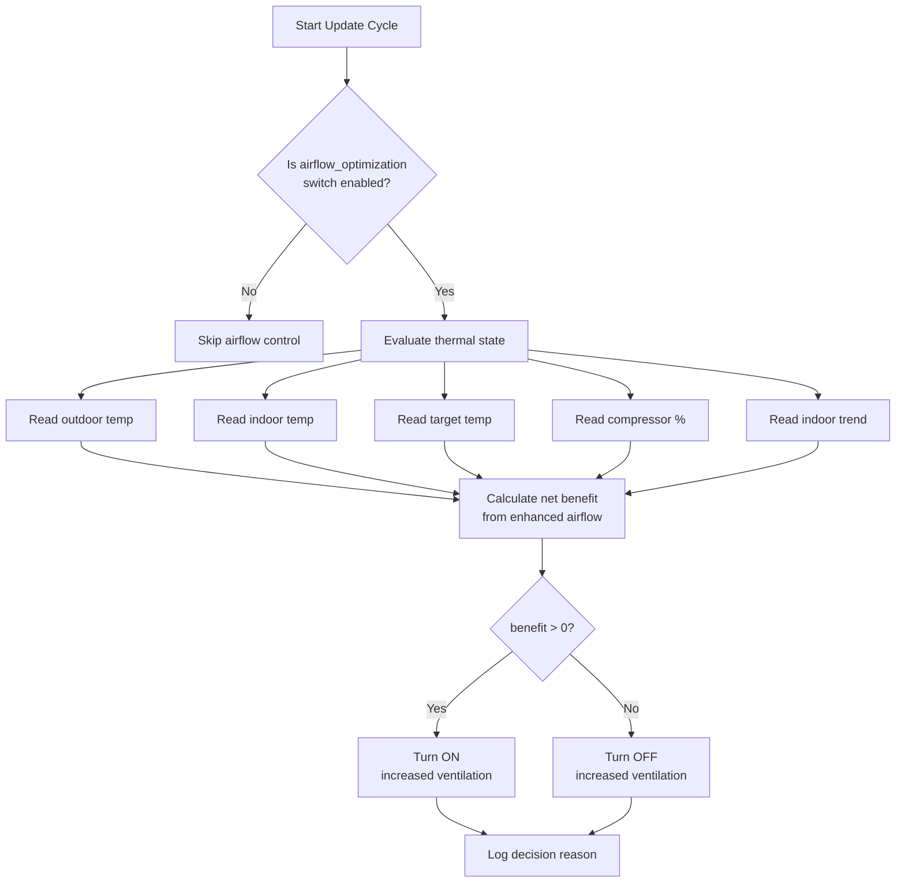

# Airflow Optimization for Exhaust Air Heat Pumps

Thermodynamic optimization for exhaust air heat pump ventilation (NIBE F750, F730).

## Overview

Exhaust air heat pumps extract heat from indoor exhaust air. When the compressor is working hard but struggling to meet demand, increasing ventilation can help by:

1. **More heat available** — Higher airflow brings more warm exhaust air to the evaporator
2. **Better COP** — Evaporator runs warmer, improving coefficient of performance by ~20%
3. **Faster recovery** — Combined effect accelerates heating during deficits

The trade-off is **ventilation penalty** — more cold outdoor air enters and must be heated.

## The Physics

> ⚠️ **This page used to add a "+20% COP improvement" term worth +1.32 kW, and concluded a net
> gain of +1.03 kW. That term double-counts.** Extracting more heat from more air and "improving
> the COP" are not two benefits; they are the same joules described twice. In steady state the
> first law gives `Q_cond = P_el + Q_evap`, so at constant electrical input
> `d(Q_cond) = d(Q_evap) = P_el · d(COP)` — an identity. Adding `P_el · d(COP)` to `d(Q_evap)`
> counts the same heat again. NIBE's own S735 manual publishes four points at identical conditions
> with exhaust airflow as the only variable, and they confirm it.

```
Net gain = (extra heat extracted at the evaporator) - (extra fresh air the building must reheat)
```

There is no third term.

| Component | Formula | At 0°C outdoor |
|-----------|---------|----------------|
| Heat extraction | Q = ṁ × cp × ΔT | +0.41 kW |
| Ventilation penalty | ṁ × cp × (T_in − T_out) | −0.70 kW |
| **Net gain** | | **-0.31 kW** |

**The net gain is negative, and it gets worse as it gets colder** (-0.65 kW at −10 °C) —
because the penalty scales with (T_in − T_out) while the extraction does not. `calculate_net_thermal_gain()`
returns this number and `airflow_optimizer` refuses to enhance when it is ≤ 0, so **on an
exhaust-air pump this feature does not currently fire at all.** That is the correct behaviour for
the physics as written; whether the feature survives at all is audit finding F-032, open with the
owner. Do not "restore" the COP term to make the numbers look better.

### Physical Constants

| Constant | Value | Description |
|----------|-------|-------------|
| `AIRFLOW_AIR_DENSITY` | 1.2 kg/m³ | At ~20°C |
| `AIRFLOW_SPECIFIC_HEAT` | 1.005 kJ/kg·K | Air at constant pressure |
| `AIRFLOW_DEFAULT_STANDARD` | 150 m³/h | NIBE F750 normal ventilation |
| `AIRFLOW_DEFAULT_ENHANCED` | 252 m³/h | NIBE F750 maximum ventilation |

## When Enhanced Airflow Helps

### ✅ Beneficial (Green Zone)

| Outdoor Temp | Min Compressor | Net Thermal Gain | Enhances? |
|--------------|----------------|------------------|-----------|
| +10°C | ≥61% | **+0.03 kW** | never fires |
| +5°C | ≥61% | **-0.14 kW** | never fires |
| +0°C | ≥61% | **-0.31 kW** | never fires |
| -5°C | ≥74% | **-0.48 kW** | never fires |
| -10°C | ≥86% | **-0.65 kW** | never fires |
| -15°C | ≥98% | **-0.82 kW** | never fires |

**Every row at or below +5 °C is negative.** The only positive gain is **+0.03 kW at +10 °C** -
and enhanced airflow is a cold-weather recovery measure, so the single temperature at which it
helps is the one at which nobody needs it. The penalty scales with (T_in − T_out); the extraction
does not.

`AIRFLOW_COMPRESSOR_BASE_THRESHOLD` is **61.0**, not the 50.0 this page used to print, so the
compressor thresholds were wrong as well. The gains above are what `calculate_net_thermal_gain()`
returns once the double-counted COP term is removed, and `airflow_optimizer` declines to enhance at
a gain ≤ 0 - so in the cold, where this feature exists to help, **it does not fire**. Whether it
survives at all is audit finding F-032, open with the owner. Do not restore the COP term to make
the table look better.

### ⚠️ Marginal (Yellow Zone)


### ❌ Don't Use (Red Zone)

| Condition | Reason |
|-----------|--------|
| Outdoor < -15°C | Ventilation penalty exceeds all gains |
| Compressor < threshold | Not limited by heat source |
| Indoor ≥ target - 0.2°C | No deficit to recover |
| Indoor trend > +0.1°C/h | Already warming, let stabilize |

## Compressor Threshold Formula

The minimum compressor % increases as outdoor temperature drops:

```
min_compressor_% = max(50, 50 + (-2.5 × outdoor_temp))
```

| Outdoor °C | Minimum Compressor % |
|------------|---------------------|
| ≥0 | 50% |
| -5 | 62% |
| -10 | 75% |
| -15 | 87% |

## Duration Guidelines

| Indoor Deficit | Base Duration | Cold Weather Adjustment |
|----------------|---------------|------------------------|
| 0.2 - 0.3°C | 15 min | — |
| 0.3 - 0.5°C | 20 min | — |
| 0.5 - 1.0°C | 45 min | Max 30 min if < -5°C |
| > 1.0°C | 60 min | Max 20 min if < -10°C |

### Stop Conditions

End enhanced ventilation when **any** of:
- Indoor temp reaches target
- Indoor trend turns positive (> +0.1°C/h)
- Compressor drops below threshold
- Maximum duration reached (anti-cycling protection)

## EffektGuard Implementation

### Entities Created

| Entity | Type | Description |
|--------|------|-------------|
| `switch.effektguard_airflow_optimization` | Switch | Enable/disable automatic airflow optimization |
| `sensor.effektguard_airflow_enhancement` | Sensor | Current decision status and reason |
| `sensor.effektguard_airflow_thermal_gain` | Sensor | Expected thermal gain (kW) |

### Model Support

Airflow optimization is only available for exhaust air heat pumps:

| Model | `supports_exhaust_airflow` | Notes |
|-------|---------------------------|-------|
| NIBE F750 | ✅ True | Exhaust air ASHP |
| NIBE F730 | ✅ True | Exhaust air ASHP |
| NIBE F2040 | ❌ False | Outdoor unit (no exhaust) |
| NIBE S1155 | ❌ False | Ground source (no exhaust) |

### NIBE Control Entity

EffektGuard controls the NIBE "Increased Ventilation" switch:
- **Entity pattern**: `switch.{device}_increased_ventilation`
- **Example**: `switch.f750_cu_3x400v_increased_ventilation`

### Automatic Control Flow



### Rate Limiting & Safety

| Protection | Value | Purpose |
|------------|-------|---------|
| Minimum enhanced duration | 5 min | Prevent rapid cycling |
| API rate limit | 5 min | Reduce MyUplink API calls |
| Redundant state check | — | Skip call if already in desired state |

## Configuration

### Options Panel

When enabled for a supported model, the Options panel shows:

| Option | Default | Description |
|--------|---------|-------------|
| Enable Airflow Optimization | Off | Master toggle |

### Advanced Tuning (const.py)

```python
# Flow rates (m³/h) - adjust for your heat pump
AIRFLOW_DEFAULT_STANDARD = 150.0  # Normal ventilation
AIRFLOW_DEFAULT_ENHANCED = 252.0  # Maximum ventilation

# Decision thresholds
AIRFLOW_OUTDOOR_TEMP_MIN = -15.0  # Don't enhance below this
AIRFLOW_INDOOR_DEFICIT_MIN = 0.2  # Minimum deficit to trigger
AIRFLOW_TREND_WARMING_THRESHOLD = 0.1  # °C/h - already warming

# Compressor threshold formula
AIRFLOW_COMPRESSOR_BASE_THRESHOLD = 61.0  # % base threshold at 0°C (81 Hz)  <- NOT 50.0
AIRFLOW_COMPRESSOR_SLOPE = -2.5  # % per °C below 0

# Duration limits (minutes)
AIRFLOW_DURATION_SMALL_DEFICIT = 15
AIRFLOW_DURATION_MODERATE_DEFICIT = 20
AIRFLOW_DURATION_LARGE_DEFICIT = 45
AIRFLOW_DURATION_EXTREME_DEFICIT = 60
AIRFLOW_DURATION_COOL_CAP = 30  # Max if outdoor < -5°C
AIRFLOW_DURATION_COLD_CAP = 20  # Max if outdoor < -10°C
```

## Code Usage

### AirflowOptimizer Class

```python
from custom_components.effektguard.optimization.airflow_optimizer import (
    AirflowOptimizer,
    FlowDecision,
)

optimizer = AirflowOptimizer(
    flow_standard=150.0,  # m³/h
    flow_enhanced=252.0,  # m³/h
)

decision = optimizer.evaluate(
    temp_outdoor=0.0,       # °C
    temp_indoor=20.5,       # °C
    temp_target=21.0,       # °C
    compressor_pct=80.0,    # % of max Hz
    trend_indoor=-0.2,      # °C/hour
)

if decision.should_enhance:
    print(f"Enhance for {decision.duration_minutes} min")
    print(f"Expected gain: {decision.expected_gain_kw:.2f} kW")
    print(f"Reason: {decision.reason}")
```

### Simple Function Interface

```python
from custom_components.effektguard.optimization.airflow_optimizer import (
    should_enhance_airflow,
)

should_enhance, duration = should_enhance_airflow(
    temp_outdoor=0.0,
    temp_indoor=20.5,
    temp_target=21.0,
    compressor_pct=80.0,
    trend_indoor=-0.2,
)
# Returns: (True, 45)
```

### Integration with NIBE Adapter

```python
# Coordinator automatically calls this
decision = self.airflow_optimizer.evaluate(...)

if decision.should_enhance:
    await self.nibe.set_enhanced_ventilation(True)
else:
    await self.nibe.set_enhanced_ventilation(False)
```

## References

- Heat transfer: `Q = ṁ × cp × ΔT`
- Carnot COP: `COP = T_hot / (T_hot - T_cold)`
- NIBE F750 specifications: 90-252 m³/h airflow range
- Implementation: `custom_components/effektguard/optimization/airflow_optimizer.py`
- Tests: `tests/unit/optimization/test_airflow_optimizer.py` (33 tests)
